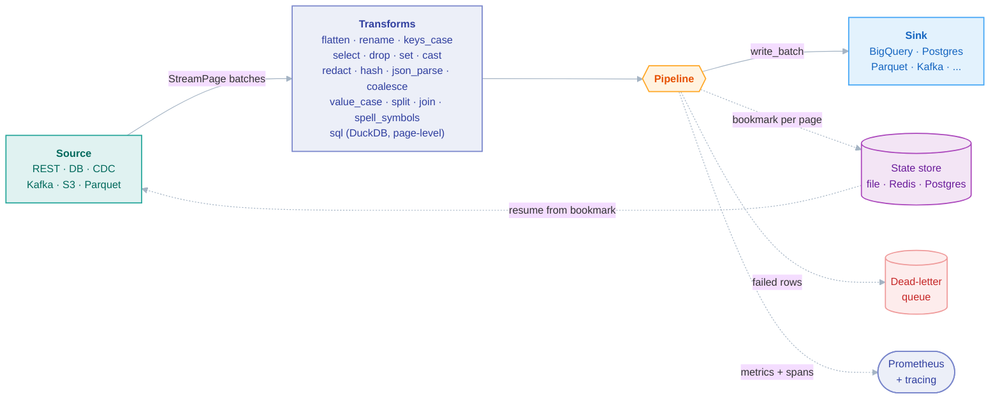

<p align="center">
  
</p>

# faucet-stream

[](https://crates.io/crates/faucet-stream)
[](https://docs.rs/faucet-stream)
[](https://faucet-hq.github.io/faucet-stream/)
[](https://github.com/faucet-hq/faucet-stream/actions/workflows/ci.yml)
[](https://codecov.io/gh/faucet-hq/faucet-stream)
[](https://crates.io/crates/faucet-stream)
[](rust-toolchain.toml)
[](deny.toml)
[](#license)
[](CHANGELOG.md)

**The fast, config-driven way to move data in Rust.**

**Move data at Rust speed, govern it in flight, and ship it as a single binary.** On a
1M-row CSV→JSONL move, faucet sustains **712k rows/s in 11.8 MiB of RAM** — **~96× faster and
~62× less memory than Meltano**, output identical row-for-row ([see the benchmarks](BENCHMARKS.md)).
No Python runtime, no platform to stand up, no daemon to babysit.

faucet-stream is a **data-movement platform** for Rust — with governance built in: **<!--COUNT:sources-->38<!--/COUNT--> source**
and **<!--COUNT:sinks-->30<!--/COUNT--> sink** connectors (**<!--COUNT:connectors-->68<!--/COUNT--> in total**) plus in-flight transforms, including a page-level
embedded-DuckDB `sql` transform — wired by a single `faucet` binary that runs pipelines
declaratively from YAML/JSON (no Rust code required), or embedded in your own service through
the typed `Source` / `Sink` traits. One platform, whether you want a CLI you can drop on any
box or a library you compile in.

📖 **[Guide](https://faucet-hq.github.io/faucet-stream/)** · 📊 **[Benchmarks](BENCHMARKS.md)** · 📜 **[Connector spec (FCP v0)](docs/spec/faucet-connector-spec-v0.md)**

```bash
brew install faucet-hq/faucet-stream/faucet-cli   # the CLI — prebuilt, no Rust needed
# — or —
curl -LsSf https://github.com/faucet-hq/faucet-stream/releases/latest/download/faucet-cli-installer.sh | sh
# — or —
cargo install faucet-cli          # build the CLI from source
# — or —
cargo add faucet-stream           # the library
```

### Why faucet-stream

- **🚀 Built for throughput** — native streaming with bounded memory, connection
  pooling, multi-row inserts, bulk APIs, and parallel I/O. Throughput is a first-class
  design goal for every connector. On single-machine batch throughput, faucet runs
  **~1–2 orders of magnitude faster than a Python Singer runtime**: a reproducible
  1M-row CSV→JSONL move (a best case that maximally exposes Python's per-row
  overhead) hit **712k rows/s in 11.8 MiB** vs Meltano's 7.4k rows/s / 724 MiB
  (~96× faster, ~62× less memory, exact row parity); sink-bound moves like
  Postgres→Postgres narrow the gap. See [`BENCHMARKS.md`](BENCHMARKS.md) for the
  methodology, the sink-bound scenario, and honest caveats.
- **🔌 Adopt incrementally — bring your Singer taps** — the `singer` source runs any
  existing Singer/Meltano tap unchanged, so you can start with the taps you already
  have and move to native connectors where throughput matters. _Experimental (v0):
  single-stream today, and a bridged tap still runs its own Python process._
- **🧩 Config-driven _or_ embeddable** — run `faucet run pipeline.yaml`, or call
  `Pipeline::new(&source, &sink).run().await?` from Rust. Same orchestration either way.
- **⚙️ A runtime, not just connectors** — incremental + resumable replication, change-data-capture,
  effectively-once delivery (idempotent dedup-on-resume), upsert/delete write modes, dead-letter
  queues, automatic retries, adaptive batch sizing, secrets-manager interpolation, cron scheduling,
  and an HTTP control plane with event-driven triggers — plus built-in Prometheus metrics +
  `tracing` spans, all with zero per-connector code.
- **🛡️ Governance in the movement path** — the guardrails most pipelines bolt on downstream, native
  and zero-config: data-quality checks, versioned data contracts, PII masking (applied *before* any
  sink sees a row), schema-drift detection & policy, column-level lineage (OpenLineage) + a
  data-movement catalog, and freshness/volume SLA monitoring.
- **📦 Pay only for what you use** — every connector is a Cargo feature, so a slim build can
  be just REST + JSONL, or pull in all <!--COUNT:connectors-->68<!--/COUNT--> connectors with `--features full`.

**Documentation:** the [faucet-stream guide](https://faucet-hq.github.io/faucet-stream/)
(getting started, tutorials, cookbook, operations) · API reference on
[docs.rs](https://docs.rs/faucet-stream) · [`cli/README.md`](cli/README.md) for the full config grammar.

---

## Table of contents

- [Quickstart — the CLI](#quickstart--the-cli)
- [Quickstart — the library](#quickstart--the-library)
- [What's in the box](#whats-in-the-box)
- [Connectors](#connectors)
- [How it compares](#how-it-compares)
- [When to use faucet-stream](#when-to-use-faucet-stream)
- [Architecture](#architecture)
- [Performance](#performance)
- [Observability](#observability)
- [Feature flags](#feature-flags)
- [Using faucet-stream as a Rust library](#using-faucet-stream-as-a-rust-library)
- [Building custom connectors](#building-custom-connectors)
- [Project structure](#project-structure)
- [Contributing](#contributing)
- [License](#license)

---

## Quickstart — the CLI

> **Just want to poke at it?** From a clone, run `./scripts/try-local.sh` — it
> builds a light feature set, runs a no-infrastructure demo (transforms,
> quality, contracts, masking, lineage, catalog, DLQ replay) against generated
> data, then leaves the [web console](https://faucet-hq.github.io/faucet-stream/getting-started/try-it-locally.html)
> running so you can browse Runs, Datasets, and Lineage. No Docker or cloud
> accounts needed.

Move data without writing any Rust:

```bash
cargo install faucet-cli
faucet init my_pipeline --source postgres --sink bigquery   # scaffold pipeline.yaml from schemas
faucet validate pipeline.yaml                               # parse + resolve secrets, no run
faucet doctor pipeline.yaml                                 # preflight: probe auth/network/permissions
faucet test tests/*.yaml                                    # offline fixture tests for pipeline logic
faucet run pipeline.yaml                                    # one-shot run to completion
faucet discover conn.yaml -o pipeline.yaml                  # introspect a database and generate a config
faucet backfill pipeline.yaml --from 2026-06-01 --to 2026-07-01 --window 1d   # resumable historical replay
faucet schedule pipeline.yaml                               # run on a cron schedule (add a schedule: block)
faucet serve --no-auth                                      # HTTP control plane: submit/poll/cancel runs over REST
```

A minimal config — fetch open GitHub issues and write them to JSON Lines:

```yaml
# faucet.yaml — `faucet run` auto-discovers this file (and a sibling `.env`) in cwd
version: 1
pipeline:
  source:
    type: rest
    config:
      base_url: https://api.github.com
      path: /repos/faucet-hq/faucet-stream/issues
      method: GET
      auth: { type: api_key, config: { header: Authorization, value: "Bearer ${env:GITHUB_TOKEN}" } }
      query_params: { state: open }
      pagination: { type: LinkHeader }
      max_retries: 3
  transforms:
    - type: keys_case          # re-case every key: snake / camel / pascal / kebab / screaming_snake
      config: { mode: snake }
  sink:
    type: jsonl
    config:
      path: ./out/issues.jsonl
```

Run many invocations from one config with a `matrix:` block (independent fan-out, a
parent/child DAG, **or** `depends_on:` completion ordering between rows), and bound
concurrency with `execution:`. See [`cli/README.md`](cli/README.md)
for the full grammar, [`cli/examples/rest_to_bigquery_matrix.yaml`](cli/examples/rest_to_bigquery_matrix.yaml)
for matrix fan-out, and [`cli/examples/rest_users_posts_dag.yaml`](cli/examples/rest_users_posts_dag.yaml)
for the DAG pattern. The [`hub/`](hub) directory is the **Template Hub** layout: a `source-template`
(one system + its streams) composes with any `sink-template` at run time — from the public hub
([faucet-hq/template-hub](https://github.com/faucet-hq/template-hub), the default `--hub`, browsable at
[faucet-hq.github.io/hub](https://faucet-hq.github.io/hub)), from files, or from the template registry
(`faucet template run <source> --sink <sink>`, `POST /v1/templates/{id}/runs`) —
`faucet run --source <owner>/<system> --sink faucet-hq/bigquery`, or `--sink faucet-hq/jsonl` to validate locally first (see the
[cookbook](https://faucet-hq.github.io/faucet-stream/cookbook/template-hub.html)). The [`cli/examples/`](cli/examples) directory has runnable configs for
every common source→sink combination.

## Quickstart — the library

Embed the same engine in a Rust service:

```bash
cargo add faucet-stream --features sink-jsonl   # default already has the REST source
cargo add tokio --features full
```

```rust
use faucet_stream::{Pipeline, RestStream, RestStreamConfig, PaginationStyle};
use faucet_stream::sink::jsonl::{JsonlSink, JsonlSinkConfig};

#[tokio::main]
async fn main() -> Result<(), Box<dyn std::error::Error>> {
    let source = RestStream::new(
        RestStreamConfig::new("https://api.example.com", "/v1/users")
            .records_path("$.data[*]")
            .pagination(PaginationStyle::Cursor {
                next_token_path: "$.meta.next_cursor".into(),
                param_name: "cursor".into(),
            }),
    )?;
    let sink = JsonlSink::new(JsonlSinkConfig::new("./users.jsonl"));

    let result = Pipeline::new(&source, &sink).run().await?;
    println!("Wrote {} records", result.records_written);
    Ok(())
}
```

More library recipes — pagination styles, OAuth2, streaming, incremental replication,
partitions, transforms, and custom connectors — are in
[Using faucet-stream as a Rust library](#using-faucet-stream-as-a-rust-library) below and the
[library tutorial](https://faucet-hq.github.io/faucet-stream/tutorials/library.html).

## What's in the box

faucet-stream is a full data-movement **runtime**, not just a bag of connectors. Every
capability below works across all connectors with zero per-connector code, and each is a
one-block addition to your YAML:

| Capability | What it does | Learn more |
|---|---|---|
| **Streaming, bounded memory** | Sources stream page-by-page; sinks write each page as it arrives — memory stays at one `batch_size` regardless of total volume. | [concepts](https://faucet-hq.github.io/faucet-stream/getting-started/concepts.html) |
| **Incremental + resumable** | Bookmark-based replication: only fetch what changed, resume mid-run from a durable state store (file / Redis / Postgres). | [state](https://faucet-hq.github.io/faucet-stream/cookbook/state.html) |
| **Change data capture** | Streaming row-level CDC for **PostgreSQL** (logical replication), **MySQL** (binlog), **MongoDB** (change streams), and **SQL Server** (CDC change tables) — resumable. | [CDC guide](https://faucet-hq.github.io/faucet-stream/reference/connectors.html) |
| **Effectively-once delivery** | Monotonic per-page commit tokens committed atomically with the data (SQL sinks, Iceberg, BigQuery), so a resumed run re-delivers no duplicates. This is idempotent at-least-once (dedup on resume), not distributed-consensus exactly-once. | [state](https://faucet-hq.github.io/faucet-stream/cookbook/state.html) |
| **Upsert / delete write modes** | `write_mode: upsert \| delete` with a `key` + `delete_marker` — merge by key on Postgres / MySQL / SQL Server / SQLite / Mongo / Elasticsearch. | [upsert](https://faucet-hq.github.io/faucet-stream/cookbook/upsert.html) |
| **Data-quality checks** | 13 per-record and per-batch assertions (not-null, regex, ranges, uniqueness, row-count, JSON Schema, …) with quarantine routing or abort policies. | [quality](https://faucet-hq.github.io/faucet-stream/cookbook/quality.html) |
| **Data contracts** | A versioned promise about the output shape (types, nullability, enums, patterns, bounds) enforced per page — breaches fail, quarantine, or warn; export as JSON Schema / OpenLineage via `faucet contract`. | [contracts](https://faucet-hq.github.io/faucet-stream/cookbook/contracts.html) |
| **SLA monitoring** | Declared freshness (`max_staleness_secs`) + volume floors and learned-baseline anomaly detection (z-score / IQR) per pipeline — violations emit metrics + warnings and surface in `faucet doctor`, never failing the run. | [SLA](https://faucet-hq.github.io/faucet-stream/cookbook/sla.html) |
| **Data-flow policies** | Label columns (by name, pattern, or value detector) and say which sinks a label may reach — `require` sink attributes such as `residency: eu`, accept a mask, or `deny`. Decided before any data moves (`validate` / `plan` / `doctor` report; `run` and `serve` refuse) and backed at run time by value detectors on the real records. | [policies](https://faucet-hq.github.io/faucet-stream/cookbook/policies.html) |
| **Change impact analysis** | `faucet plan --impact` diffs the planned output schema against the catalog and walks the lineage graph downstream: which datasets, contracts, owners and declared consumers a dropped / retyped / renamed column breaks, with a severity each — before the change ships. | [impact](https://faucet-hq.github.io/faucet-stream/cookbook/impact.html) |
| **Column profiling** | Learned per-column profiles (null rate, type mix, distinct, numeric / string summaries, top values) in bounded memory, compared against a rolling baseline every run — statistically significant drift is reported per column with no thresholds to write; `warn`, `notify`, or `fail`. | [profiling](https://faucet-hq.github.io/faucet-stream/cookbook/profiling.html) |
| **Cost & usage accounting + run budgets** | Every invocation is metered — records, estimated bytes, backend round trips, connector cost signals (BigQuery bytes billed, S3/GCS requests) — priced against a `usage:` rate table you control and compared to a per-row-priced hosted ELT equivalent, always labelled as an estimate; `faucet usage` / `GET /v1/usage` / the console aggregate by pipeline, row, dataset, sink or day. A `budget:` block puts hard ceilings on a run (`max_records` / `max_bytes` refuse the crossing page whole, `max_duration_secs` cancels at a page boundary, `allowed_sinks` refuses before anything runs). See the [usage cookbook](https://faucet-hq.github.io/faucet-stream/cookbook/usage.html). |
| **Change approvals (plan → approve → run)** | `POST /v1/changes`, the console's Changes page, or an agent's MCP `propose_run` / `propose_template` files a run, template registration or launch as a change request with its plan (rows, delivery guarantee, policy verdict, impact) and a budget; the approvers the `approvals:` block of `--auth-config` names approve it, faucet re-plans and runs it — or marks it `invalidated` if the plan changed underneath. `--require-approval run` makes the gate mandatory. Every step is audited. See the [approvals cookbook](https://faucet-hq.github.io/faucet-stream/cookbook/approvals.html). |
| **Dead-letter queue** | Route failed rows to any sink instead of aborting the run, with a fixed envelope and reason. | [DLQ](https://faucet-hq.github.io/faucet-stream/cookbook/dlq.html) |
| **Adaptive batch sizing** | Opt-in AIMD controller that tunes write batch size from observed sink latency and error rate. | [tuning](https://faucet-hq.github.io/faucet-stream/) |
| **Secrets-manager interpolation** | `${vault:…}`, `${aws-sm:…}`, `${gcp-sm:…}`, `${azure-kv:…}` resolved at load time, redacted from logs. | [secrets](https://faucet-hq.github.io/faucet-stream/cookbook/secrets.html) |
| **Cron scheduling** | `faucet schedule` — DST-correct cron, overlap policies, run timeouts, graceful drain. | [scheduling](https://faucet-hq.github.io/faucet-stream/) |
| **HTTP control plane** | `faucet serve` — submit / poll / cancel runs over REST, idempotency keys, run history, optional embedded web console (`serve-ui`), clustered execution. | [serve](https://faucet-hq.github.io/faucet-stream/) |
| **Event-driven triggers** | `faucet serve --triggers` — auto-enqueue runs on object-arrival (S3/GCS), webhook, or queue-depth (Redis/Kafka). | [triggers](https://faucet-hq.github.io/faucet-stream/reference/triggers.html) |
| **OpenLineage emission** | Emit START/RUNNING/COMPLETE/FAIL events with schema facets and column-level lineage over HTTP / file / Kafka. | [lineage](https://faucet-hq.github.io/faucet-stream/cookbook/lineage.html) |
| **Observability** | Automatic Prometheus metrics + `tracing` spans for every source, sink, transform, and state op — labelled by pipeline / row / connector. | [observability](cli/README.md#observability-prometheus--tracing) |
| **Transforms** | `flatten`, `rename_keys`, `keys_case`, `select`, `drop`, `set`, `rename_field`, `cast`, `redact`, `hash`, `json_parse`, `coalesce`, `value_case`, `split`, `join`, `spell_symbols`, `cdc_unwrap`, `sql` (embedded DuckDB, page-level), and `wasm` (custom code in any language, per-record, sandboxed). | [transforms](https://faucet-hq.github.io/faucet-stream/cookbook/transforms.html) |

## Connectors

All connector crates depend only on `faucet-core`, so any source pairs with any sink. See
the [connector capability matrix](https://faucet-hq.github.io/faucet-stream/reference/connectors.html)
(streaming, resumable state, compression, auth per connector) and the
[choosing-a-connector guide](https://faucet-hq.github.io/faucet-stream/reference/choosing.html)
for help picking between overlapping connectors (Postgres query vs CDC, S3 vs Parquet, Redis vs Kafka, …).

> **Support tiers** (the **Tier** column below). A connector is **Tier-1 ✅** when
> it invokes and passes the [`faucet-conformance`](crates/conformance) battery in
> CI against the connector's real backend — valid config schema, bounded-memory
> streaming, bookmark round-trip, idempotent replay, truthful capabilities,
> errors-not-panics (see the [Faucet Connector Protocol spec](docs/spec/faucet-connector-spec-v0.md)).
> **That battery *is* the tiering mechanism** — there is no separate scheme, and
> the Tier-1 set grows as more connectors wire it in. **ᵐ** marks a connector
> whose battery runs against a **wiremock HTTP mock** in CI rather than a live
> service (the `rest`, `graphql`, `xml`, `elasticsearch`, `bigquery`, `snowflake`,
> `databricks` sources and the `http` sink): the mock faithfully drives the
> paging / schema / error paths the checks assert, but it is not an end-to-end
> test against the real system. **ᵉ** marks a connector whose battery runs against
> an official **emulator** in Docker — a real implementation, not the managed
> service: the Cloud **Spanner** pair (Spanner emulator), the **Pub/Sub** source
> and sink (Pub/Sub emulator), and the **Azure Blob** sink (Azurite). Unmarked
> **T1 ✅** connectors run against a real backend with no caveat — a local
> filesystem (`delta`, `parquet`, `csv`) or a testcontainers-launched real server
> (`postgres`, `mysql`, `mongodb`, `redis`, `clickhouse`, `kafka`, …).
> **Tier-2** connectors are **not conformance-certified in CI** — their full
> battery can't run without a live cloud backend (the BigQuery / Snowflake /
> Elasticsearch sinks are tested against wiremock, which can't prove real
> idempotent dedup; the GCS source/sink need a real gRPC backend the emulator
> doesn't provide), or the connector's shape doesn't fit a check (the webhook
> source is buffer-shaped; the append-only Iceberg sink's terminal `flush`
> doesn't fit the effectively-once replay check). They still have their own
> extensive integration tests (wiremock / testcontainers) and are used in
> production — Tier-2 means "not certified," **not** "low quality." The Singer
> bridge is additionally **experimental (v0, single-stream)** ⚠️.

### Sources (33)

`Tier`: **T1 ✅** = passes the `faucet-conformance` battery in CI; **T2** = not yet
wired into the battery (see the support-tiers note above).

| Crate | Tier | Description |
|-------|------|-------------|
| [`faucet-source-rest`](crates/source/rest) | **T1 ✅ᵐ** | REST API — auth, pagination, extraction, schema inference |
| [`faucet-source-graphql`](crates/source/graphql) | T1 ✅ᵐ | GraphQL API — cursor-based pagination, variable injection |
| [`faucet-source-xml`](crates/source/xml) | T1 ✅ᵐ | XML/SOAP API — XML-to-JSON conversion, dot-path extraction |
| [`faucet-source-grpc`](crates/source/grpc) | T1 ✅ | gRPC — dynamic protobuf via `prost-reflect`, unary + server-streaming |
| [`faucet-source-postgres`](crates/source/postgres) | **T1 ✅** | PostgreSQL — run SQL queries, return rows as JSON |
| [`faucet-source-postgres-cdc`](crates/source/postgres-cdc) | T1 ✅ | PostgreSQL CDC — logical replication via pgoutput, resumable |
| [`faucet-source-mysql`](crates/source/mysql) | T1 ✅ | MySQL — run SQL queries, return rows as JSON |
| [`faucet-source-mysql-cdc`](crates/source/mysql-cdc) | T1 ✅ | MySQL CDC — binlog row events, resumable via file/pos or GTID |
| [`faucet-source-mssql`](crates/source/mssql) | T1 ✅ | Microsoft SQL Server — streaming queries, incremental replication |
| [`faucet-source-mssql-cdc`](crates/source/mssql-cdc) | T1 ✅ | Microsoft SQL Server CDC — change tables (`fn_cdc_get_all_changes`), LSN bookmarks, resumable |
| [`faucet-source-sqlite`](crates/source/sqlite) | **T1 ✅** | SQLite — run SQL queries, return rows as JSON |
| [`faucet-source-duckdb`](crates/source/duckdb) | T2 | DuckDB — run SQL against a file or `:memory:` database, stream rows as JSON |
| [`faucet-source-sqs`](crates/source/sqs) | T2 | AWS SQS — long-poll receive, delete-after-emit (at-least-once), idle/max termination |
| [`faucet-source-nats`](crates/source/nats) | T2 | NATS — subject subscription or JetStream consumer; idle/max termination |
| [`faucet-source-rabbitmq`](crates/source/rabbitmq) | T2 | RabbitMQ (AMQP 0.9.1) — queue consumer, optional declare + bind; acks each page only after the sink flushes it; idle/max termination |
| [`faucet-source-sftp`](crates/source/sftp) | T2 | SFTP — list/glob a remote directory over SSH; JSONL / JSON array / raw text |
| [`faucet-source-mongodb`](crates/source/mongodb) | T1 ✅ | MongoDB — find() with filter, projection, sort |
| [`faucet-source-mongodb-cdc`](crates/source/mongodb-cdc) | T1 ✅ | MongoDB CDC — Change Streams, resumable via resumeToken |
| [`faucet-source-redis`](crates/source/redis) | T1 ✅ | Redis — read from streams, lists, or key patterns |
| [`faucet-source-kafka`](crates/source/kafka) | T1 ✅ | Apache Kafka — consumer with idle/max-messages termination |
| [`faucet-source-kinesis`](crates/source/kinesis) | T1 ✅ | AWS Kinesis Data Streams — sharded consumer with resumable sequence checkpoints |
| [`faucet-source-pubsub`](crates/source/pubsub) | T1 ✅ᵉ | Google Cloud Pub/Sub — streaming pull; per-message records + attributes, resumable |
| [`faucet-source-s3`](crates/source/s3) | T1 ✅ | AWS S3 — read objects as JSONL, JSON array, or raw text |
| [`faucet-source-gcs`](crates/source/gcs) | T2 | Google Cloud Storage — read objects as JSONL, JSON array, or raw text |
| [`faucet-source-azure-blob`](crates/source/azure-blob) | T1 ✅ | Azure Blob / ADLS Gen2 — read objects as JSONL, JSON array, or raw text |
| [`faucet-source-parquet`](crates/source/parquet) | T1 ✅ | Apache Parquet — local file, glob, or S3; vectorized Arrow reader, projection |
| [`faucet-source-delta`](crates/source/delta) | T1 ✅ | Apache Delta Lake — local FS or S3/Azure/GCS; time travel, projection pushdown |
| [`faucet-source-databricks`](crates/source/databricks) | T1 ✅ᵐ | Databricks SQL query source (Statement Execution API) — typed rows, chunk pagination, incremental |
| [`faucet-source-redshift`](crates/source/redshift) | T1 ✅ | Amazon Redshift — SQL query over the PostgreSQL wire, incremental replication |
| [`faucet-source-clickhouse`](crates/source/clickhouse) | T1 ✅ | ClickHouse — HTTP interface, `FORMAT JSONEachRow` streaming, incremental replication |
| [`faucet-source-elasticsearch`](crates/source/elasticsearch) | T1 ✅ᵐ | Elasticsearch — search/scroll API |
| [`faucet-source-bigquery`](crates/source/bigquery) | T1 ✅ᵐ | Google BigQuery — `jobs.query` + `getQueryResults`, type-aware decoding |
| [`faucet-source-snowflake`](crates/source/snowflake) | T1 ✅ᵐ | Snowflake — SQL REST API, server-side partition pagination, JWT / OAuth |
| [`faucet-source-spanner`](crates/source/spanner) | T1 ✅ᵉ | Google Cloud Spanner — streaming SQL over gRPC, incremental replication, stale reads, PK-range sharding |
| [`faucet-source-webhook`](crates/source/webhook) | T2 | Webhook — temporary HTTP server collecting POST payloads |
| [`faucet-source-websocket`](crates/source/websocket) | T1 ✅ | WebSocket — live streaming feed; subscribe frames, reconnect, keepalive |
| [`faucet-source-csv`](crates/source/csv) | **T1 ✅** | CSV — read CSV files as JSON objects |
| [`faucet-source-singer`](crates/source/singer) | T2 ⚠️ | **Singer tap bridge** — run any Singer tap and adapt its output. Passes the battery, but **experimental (v0, single-stream)** |

### Sinks (25)

| Crate | Tier | Description |
|-------|------|-------------|
| [`faucet-sink-bigquery`](crates/sink/bigquery) | T2 | Google BigQuery — streaming inserts; effectively-once via MERGE |
| [`faucet-sink-iceberg`](crates/sink/iceberg) | T2 | Apache Iceberg — append snapshots via REST/Glue/SQL/HMS catalogs |
| [`faucet-sink-postgres`](crates/sink/postgres) | T1 ✅ | PostgreSQL — JSONB or auto-mapped columns; upsert/delete |
| [`faucet-sink-mysql`](crates/sink/mysql) | T1 ✅ | MySQL — JSON column or auto-mapped columns; upsert/delete |
| [`faucet-sink-mssql`](crates/sink/mssql) | T1 ✅ | Microsoft SQL Server — JSON or auto-mapped columns, 2100-param split |
| [`faucet-sink-sqlite`](crates/sink/sqlite) | **T1 ✅** | SQLite — JSON column or auto-mapped columns; upsert/delete; effectively-once |
| [`faucet-sink-duckdb`](crates/sink/duckdb) | T2 | DuckDB — transaction-wrapped multi-row INSERT (JSON column or auto-mapped); append-only |
| [`faucet-sink-sqs`](crates/sink/sqs) | T2 | AWS SQS — batched SendMessageBatch with per-entry retry; FIFO group/dedup |
| [`faucet-sink-nats`](crates/sink/nats) | T2 | NATS — publish records to a subject (optional subject-per-record), flush per batch |
| [`faucet-sink-rabbitmq`](crates/sink/rabbitmq) | T2 | RabbitMQ (AMQP 0.9.1) — publish to an exchange with a static or per-record routing key; publisher confirms; unroutable rows are DLQ-routable |
| [`faucet-sink-sftp`](crates/sink/sftp) | T2 | SFTP — write JSONL files over SSH with atomic temp-then-rename |
| [`faucet-sink-snowflake`](crates/sink/snowflake) | T2 | Snowflake — SQL REST API with JWT/OAuth |
| [`faucet-sink-redshift`](crates/sink/redshift) | T1 ✅ | Amazon Redshift — COPY-from-S3 (staged) or multi-row `INSERT`; append-only |
| [`faucet-sink-clickhouse`](crates/sink/clickhouse) | T1 ✅ | ClickHouse — `INSERT … FORMAT JSONEachRow`; optional `async_insert`; append-only |
| [`faucet-sink-mongodb`](crates/sink/mongodb) | T1 ✅ | MongoDB — insert_many; upsert/delete by key |
| [`faucet-sink-redis`](crates/sink/redis) | T1 ✅ | Redis — write to streams, lists, or key-value |
| [`faucet-sink-kafka`](crates/sink/kafka) | T1 ✅ | Apache Kafka — producer with batching, multi-topic routing |
| [`faucet-sink-kinesis`](crates/sink/kinesis) | T1 ✅ | AWS Kinesis Data Streams — batched PutRecords with partition-key routing |
| [`faucet-sink-pubsub`](crates/sink/pubsub) | T1 ✅ᵉ | Google Cloud Pub/Sub — batched publish; optional ordering key, per-entry retry |
| [`faucet-sink-spanner`](crates/sink/spanner) | T1 ✅ᵉ | Google Cloud Spanner — batched mutations; upsert/delete, effectively-once commit tokens, schema evolution |
| [`faucet-sink-elasticsearch`](crates/sink/elasticsearch) | T2 | Elasticsearch — bulk index API; upsert/delete by `_id` |
| [`faucet-sink-s3`](crates/sink/s3) | T1 ✅ | AWS S3 — write JSONL files to bucket |
| [`faucet-sink-gcs`](crates/sink/gcs) | T2 | Google Cloud Storage — write JSONL files to bucket |
| [`faucet-sink-azure-blob`](crates/sink/azure-blob) | T1 ✅ᵉ | Azure Blob / ADLS Gen2 — write JSONL blobs; batch/byte rollover |
| [`faucet-sink-parquet`](crates/sink/parquet) | T1 ✅ | Apache Parquet — local file or S3; schema inference, row/byte rollover |
| [`faucet-sink-delta`](crates/sink/delta) | T1 ✅ | Apache Delta Lake — append-only; local FS or S3/Azure/GCS; one commit per flush |
| [`faucet-sink-jsonl`](crates/sink/jsonl) | **T1 ✅** | JSON Lines — file output with append/truncate |
| [`faucet-sink-csv`](crates/sink/csv) | T1 ✅ | CSV — write JSON records as CSV rows |
| [`faucet-sink-http`](crates/sink/http) | T1 ✅ᵐ | HTTP — POST records to any endpoint |
| [`faucet-sink-stdout`](crates/sink/stdout) | T1 ✅ | Stdout/stderr — JSON Lines, pretty JSON, or TSV |

<details>
<summary><b>Supporting crates</b> — core, shared connector libraries, state stores, lineage, transforms, umbrella, CLI</summary>

| Crate | Description |
|-------|-------------|
| [`faucet-core`](crates/core) | Shared types, traits (`Source`, `Sink`, `AuthProvider`), pipeline orchestration, transforms, error types |
| [`faucet-auth`](crates/auth) | Shared single-flight auth providers (OAuth2, token-endpoint) for `auth: { ref }` |
| [`faucet-common-bigquery`](crates/common/bigquery) | Shared BigQuery types — `BigQueryCredentials` enum and `build_client` helper |
| [`faucet-common-elasticsearch`](crates/common/elasticsearch) | Shared `ElasticsearchAuth` enum for Elasticsearch source/sink |
| [`faucet-common-gcs`](crates/common/gcs) | Shared GCS types — credentials enum, Storage/StorageControl client builders |
| [`faucet-common-kafka`](crates/common/kafka) | Shared Kafka types — auth, value formats, Schema Registry client |
| [`faucet-common-snowflake`](crates/common/snowflake) | Shared Snowflake types — `SnowflakeAuth` enum + auth header helpers |
| [`faucet-common-spanner`](crates/common/spanner) | Shared Cloud Spanner types — credentials enum, connection/client builders, value conversion |
| [`faucet-common-mssql`](crates/common/mssql) | Shared MSSQL types — connection/TLS config, `tiberius`+`bb8` pool builder, identifier quoting |
| [`faucet-state-redis`](crates/state/redis) | Redis-backed `StateStore` for persistent bookmarks |
| [`faucet-state-postgres`](crates/state/postgres) | PostgreSQL-backed `StateStore` for persistent bookmarks |
| [`faucet-lineage`](crates/lineage) | OpenLineage event emission — HTTP/file/Kafka transports, schema facets, column-lineage analysis |
| [`faucet-transform-sql`](crates/transform-sql) | Embedded DuckDB SQL transform — run DuckDB SQL over each page (`batch` relation) |
| [`faucet-transform-wasm`](crates/transform-wasm) | WebAssembly transform — run a user-provided sandboxed `.wasm` module per record (wasmtime) |
| [`faucet-stream`](faucet-stream) | Umbrella crate — feature-gated re-exports of all connectors and state backends |
| [`faucet-cli`](cli) | `faucet` binary — YAML/JSON config-driven pipeline runner (`run`, `validate`, `schema`, `list`, `preview`, `init`, `doctor`, `test`, `schedule`, `serve`) |

</details>

### Install

**CLI — prebuilt binaries** (macOS arm64/x86_64, Linux x86_64/aarch64; no Rust toolchain
required). Includes every first-party connector plus `serve` (web console), `schedule`,
and `lineage`:

```bash
# Homebrew
brew install faucet-hq/faucet-stream/faucet-cli

# Shell installer (installs to ~/.cargo/bin by default, checksummed)
curl -LsSf https://github.com/faucet-hq/faucet-stream/releases/latest/download/faucet-cli-installer.sh | sh

# Or download an archive + SHA256 checksum from the latest faucet-cli GitHub Release
```

**CLI — from source** (full/custom feature sets, e.g. DuckDB SQL transforms, OTLP export):

```bash
cargo install faucet-cli                   # default feature set
cargo install faucet-cli --features full   # everything
```

**Library:**

```bash
# Everything (default includes the REST source)
cargo add faucet-stream

# All sources / all sinks / all connectors
cargo add faucet-stream --features source
cargo add faucet-stream --features sink
cargo add faucet-stream --features full

# Pick individual connectors
cargo add faucet-stream --features source-rest,sink-postgres,sink-s3

# Or depend on individual connector crates directly
cargo add faucet-source-rest
cargo add faucet-source-mongodb
```

## How it compares

There are many great data-movement tools. faucet-stream's niche is being **a single fast
native binary _and_ an embeddable Rust library** — config-driven, with no Python runtime, no
platform to operate, and a typed library API when you want to compile pipelines into your
own service.

| | **faucet-stream** | Meltano (Singer) | Airbyte | Benthos / Redpanda Connect | Vector | Fivetran |
|---|---|---|---|---|---|---|
| Runtime | Rust, native binary | Python | Java/Python on Docker | Go, native binary | Rust, native binary | Hosted SaaS |
| Single static binary | ✓ | ✗ | ✗ | ✓ | ✓ | n/a |
| Config-driven (YAML/JSON) | ✓ | ✓ | via UI/API | ✓ | ✓ | via UI |
| Embeddable as a library | ✓ (Rust) | ✗ | ✗ | ✓ (Go) | ✗ | ✗ |
| Connector count | 58, growing | 600+ taps | 350+ | dozens | dozens | 500+ |
| Runs existing Singer taps | ✓ bridge (experimental) | ✓ native | ✗ | ✗ | ✗ | ✗ |
| Change data capture | ✓ Postgres / MySQL / Mongo / SQL Server | partial¹ | ✓ | partial | ✗ | ✓ |
| Incremental + resumable state | ✓ | ✓ | ✓ | partial | n/a | ✓ |
| Effectively-once delivery³ | ✓ (11 sinks incl. Kafka, Iceberg, BigQuery) | ✗ | partial | ✗ | ✗ | ✓ |
| Built-in data-quality checks | ✓ native | ✗ | paywalled add-on | ✗ | ✗ | paywalled add-on |
| Built-in metrics + tracing | ✓ Prometheus + OTLP + `tracing` | partial | ✓ (platform) | ✓ | ✓ | ✓ (hosted) |
| Self-hosted, no daemon | ✓ run-to-completion | ✓ | ✗ needs platform | usually a service | agent | ✗ SaaS |
| License | MIT / Apache-2.0 | MIT | ELv2 + MIT | Apache-2.0 / source-available² | MPL-2.0 | Proprietary |

¹ Singer CDC depends on the individual tap. ² The original Benthos is Apache-2.0; Redpanda Connect's maintained build is source-available. ³ "Effectively-once" = idempotent at-least-once: per-page commit tokens are committed atomically with the data so a resumed run drops duplicates — not distributed-consensus exactly-once (see [delivery guarantees](https://faucet-hq.github.io/faucet-stream/cookbook/state.html)). *Comparison reflects the general shape of each tool as of 2026-05 — check each project for current details.*

For reference: **[Singer](https://www.singer.io/)** is a connector spec and **[Meltano](https://meltano.com/)**
is its most common runtime; both appear above. faucet-stream is a full **ETL** tool — it
transforms data *in flight* as it moves (11 record transforms plus filter,
explode, and CDC-unwrap stages and a page-level embedded-DuckDB `sql` transform
for aggregation, joins, and filtering), not just extract-and-load. **[dbt](https://www.getdbt.com/) is complementary, not a competitor:**
it models transformations *in the warehouse* on data already loaded (the "T" of ELT, at
warehouse scale) — pair the two when you need heavy in-warehouse modeling on top of what
faucet extracts, transforms, and loads.

**Deep dives** (detailed, and honest about where each tool wins): [vs. Meltano](https://faucet-hq.github.io/faucet-stream/comparison/meltano.html) · [vs. Airbyte](https://faucet-hq.github.io/faucet-stream/comparison/airbyte.html) · [vs. Singer](https://faucet-hq.github.io/faucet-stream/comparison/singer.html).

## When to use faucet-stream

**Reach for it when:**

- You want **one fast static binary** (or a Rust library) to move data between APIs, databases, object stores, and warehouses — without standing up a platform, scheduler, or Python environment.
- You want **version-controlled, config-driven pipelines** you can run anywhere: locally, in CI, behind cron, or inside another service.
- You need **streaming with bounded memory, incremental/resumable replication, CDC, effectively-once delivery, data-quality assertions, retries, dead-letter queues, and metrics** without hand-writing that plumbing.
- You're **already in Rust** and want typed `Source`/`Sink` traits you can embed and extend.

**Look elsewhere (for now) when:**

- You need a connector faucet-stream **doesn't ship yet and can't write** — [Meltano](https://meltano.com/) (600+ Singer taps) and [Airbyte](https://airbyte.com/) (350+) have far broader catalogs today.
- You want a **fully-managed, hosted service** with a UI and a team operating it — Fivetran or Airbyte Cloud.
- Your job is **heavy in-warehouse transformation modeling** — a tested, version-controlled SQL DAG built on data already in the warehouse, at warehouse scale. That's dbt's domain; pair it with faucet-stream, which extracts, transforms in-flight, and loads.
- You need a **continuous record-by-record streaming processor** — [Benthos / Redpanda Connect](https://www.redpanda.com/connect) and [Vector](https://vector.dev/) are purpose-built for that. faucet-stream runs discrete pipelines to completion; even the long-running modes (`faucet schedule`, `faucet serve`) orchestrate complete runs rather than a never-ending stream.

## Architecture

A `Source` streams batches of records, optional `Transform`s reshape them, and the
`Pipeline` writes each batch to a `Sink` — bounding memory at one batch on both sides
regardless of total volume. The pipeline also drives the cross-cutting runtime (bookmarks,
dead-letter routing, quality checks, metrics) so connectors stay simple:



faucet-stream is a Cargo workspace with **<!--COUNT:crates-->95<!--/COUNT--> crates** — <!--COUNT:sources-->38<!--/COUNT--> sources, <!--COUNT:sinks-->30<!--/COUNT--> sinks, <!--COUNT:common-->17<!--/COUNT--> shared
connector libraries, the shared auth-provider library, 2 state-store backends, the lineage
crate, the SQL transform crate, the conformance test battery, the shared core, the umbrella
crate, and the CLI binary. See
the [Connectors](#connectors) table above and the
[architecture guide](https://faucet-hq.github.io/faucet-stream/getting-started/concepts.html).

## Performance

> **Performance and reliability are why this library exists.** Every connector is optimised
> for throughput out of the box — there are no "slow defaults" to tune away.

| Technique | Where |
|-----------|-------|
| **Parallel I/O** | S3/GCS read/write objects concurrently (configurable `concurrency`); HTTP sink sends requests in parallel; REST source processes partitions concurrently |
| **Multi-row INSERT** | PostgreSQL, MySQL, SQLite, and SQL Server sinks batch records into single INSERT statements instead of one per row (MSSQL auto-splits at the 2100-parameter limit) |
| **Transaction wrapping** | SQLite sink wraps batches in `BEGIN`/`COMMIT` for a large write speedup |
| **Connection pooling** | All database connectors use connection pools with configurable `max_connections` |
| **Connection reuse** | S3, MongoDB, Redis, Elasticsearch, and HTTP connectors create clients once and reuse them across all operations |
| **Redis pipelining** | Redis sink batches commands with `pipe()`; Redis source uses `MGET` for bulk key reads |
| **Bulk APIs** | Elasticsearch uses the bulk NDJSON API; BigQuery uses `insertAll`; MongoDB uses `insert_many` |
| **Buffered I/O** | JSONL sink uses `BufWriter`; CSV uses buffered readers/writers in blocking threads |
| **Streaming pagination** | Sources stream pages one at a time via `stream_pages()` to bound memory |
| **Adaptive batch sizing** | Opt-in AIMD controller tunes the effective write batch size from observed sink latency and error rate |

## Observability

Every pipeline emits OTel-compatible `tracing` spans and Prometheus metrics automatically —
labelled by `pipeline`, `row` (matrix row id), and `connector`, with **zero per-connector
code**. The CLI exposes a `/metrics` endpoint via the optional `observability:` block in
`faucet.yaml`. See the [CLI README](cli/README.md#observability-prometheus--tracing) for the
YAML grammar and the OpenTelemetry bridge snippet.

## Feature flags

Default features: `source-rest`, `transform-flatten`, `transform-rename-keys`,
`transform-keys-case`. Every connector and capability is an opt-in Cargo feature.

<details>
<summary><b>Full feature-flag table (umbrella crate)</b></summary>

| Feature | Default | Description |
|---------|---------|-------------|
| `source-rest` | yes | REST API source |
| `source-graphql` | no | GraphQL API source |
| `source-xml` | no | XML/SOAP API source |
| `source-grpc` | no | gRPC source |
| `source-postgres` | no | PostgreSQL query source |
| `source-postgres-cdc` | no | PostgreSQL CDC source (logical replication) |
| `source-mysql` | no | MySQL query source |
| `source-mysql-cdc` | no | MySQL CDC source (binlog replication) |
| `source-mssql` | no | Microsoft SQL Server query source |
| `source-mssql-cdc` | no | Microsoft SQL Server CDC source (change tables) |
| `source-sqlite` | no | SQLite query source |
| `source-duckdb` | no | DuckDB query source |
| `source-sqs` | no | AWS SQS source |
| `source-nats` | no | NATS source |
| `source-rabbitmq` | no | RabbitMQ source |
| `source-sftp` | no | SFTP source |
| `source-mongodb` | no | MongoDB query source |
| `source-mongodb-cdc` | no | MongoDB CDC source (Change Streams) |
| `source-redis` | no | Redis source |
| `source-kafka` | no | Apache Kafka consumer source |
| `source-kinesis` | no | AWS Kinesis Data Streams source |
| `source-pubsub` | no | Google Cloud Pub/Sub source |
| `source-s3` | no | AWS S3 file source |
| `source-gcs` | no | Google Cloud Storage file source |
| `source-azure-blob` | no | Azure Blob / ADLS Gen2 file source |
| `source-parquet` | no | Apache Parquet file source (local, glob, S3) |
| `source-delta` | no | Apache Delta Lake source (local FS; S3/Azure/GCS via `delta-s3`/`delta-azure`/`delta-gcs`) |
| `source-databricks` | no | Databricks SQL query source (Statement Execution API) |
| `sink-delta` | no | Apache Delta Lake sink (local FS; S3/Azure/GCS via `delta-s3`/`delta-azure`/`delta-gcs`) |
| `source-elasticsearch` | no | Elasticsearch source |
| `source-bigquery` | no | Google BigQuery query source |
| `source-snowflake` | no | Snowflake query source |
| `source-redshift` | no | Amazon Redshift query source (PostgreSQL wire) |
| `source-clickhouse` | no | ClickHouse query source (HTTP interface) |
| `source-spanner` | no | Google Cloud Spanner query source |
| `source-webhook` | no | Webhook HTTP receiver |
| `source-websocket` | no | WebSocket live streaming source |
| `source-csv` | no | CSV file source |
| `sink-bigquery` | no | Google BigQuery sink |
| `sink-iceberg` | no | Apache Iceberg sink (append, REST/Glue/SQL/HMS catalogs) |
| `sink-postgres` | no | PostgreSQL sink |
| `sink-mysql` | no | MySQL sink |
| `sink-mssql` | no | Microsoft SQL Server sink |
| `sink-sqlite` | no | SQLite sink |
| `sink-duckdb` | no | DuckDB sink |
| `sink-sqs` | no | AWS SQS sink |
| `sink-nats` | no | NATS sink |
| `sink-rabbitmq` | no | RabbitMQ sink |
| `sink-sftp` | no | SFTP sink |
| `sink-snowflake` | no | Snowflake sink |
| `sink-redshift` | no | Amazon Redshift sink (COPY-from-S3 or multi-row INSERT) |
| `sink-clickhouse` | no | ClickHouse sink (INSERT … FORMAT JSONEachRow) |
| `sink-mongodb` | no | MongoDB sink |
| `sink-redis` | no | Redis sink |
| `sink-kafka` | no | Apache Kafka producer sink |
| `sink-kinesis` | no | AWS Kinesis Data Streams sink |
| `sink-pubsub` | no | Google Cloud Pub/Sub sink |
| `sink-spanner` | no | Google Cloud Spanner sink |
| `sink-elasticsearch` | no | Elasticsearch bulk index sink |
| `sink-s3` | no | AWS S3 file sink |
| `sink-gcs` | no | Google Cloud Storage file sink |
| `sink-azure-blob` | no | Azure Blob / ADLS Gen2 file sink |
| `sink-parquet` | no | Apache Parquet file sink (local, S3) |
| `sink-jsonl` | no | JSON Lines file sink |
| `sink-csv` | no | CSV file sink |
| `sink-http` | no | HTTP POST sink |
| `sink-stdout` | no | Stdout/stderr sink (JSON Lines, pretty JSON, TSV) |
| `kafka-schema-registry` | no | Confluent Schema Registry support for the Kafka pair (Avro, Protobuf, JSON Schema) |
| `state-redis` | no | Redis-backed `StateStore` backend |
| `state-postgres` | no | PostgreSQL-backed `StateStore` backend |
| `source` / `sink` / `state` | no | All sources / all sinks / all state backends |
| `auth` | no | Shared OAuth2 / token-endpoint auth providers |
| `full` | no | Every connector, state backend, and capability |
| `transform-flatten` | yes | Flatten nested objects |
| `transform-rename-keys` | yes | Regex key renaming |
| `transform-keys-case` | yes | Re-case every key — snake / camel / pascal / kebab / screaming_snake / dot |
| `transform-select` / `transform-drop` / `transform-set` | no | Keep / remove / add top-level fields |
| `transform-rename-field` | no | Exact-name field rename (single or batch) |
| `transform-cast` | no | Per-field type coercion with `on_error` policy |
| `transform-redact` | no | Replace listed field values with a mask |
| `transform-hash` | no | Hash fields (SHA-256 / BLAKE3) into stable, join-able tokens |
| `transform-json-parse` | no | Parse a stringified-JSON field into a nested value |
| `transform-coalesce` | no | Fill a missing/null field from a default or first non-null key |
| `transform-value-case` | no | Lowercase / uppercase / trim / title / capitalize string field values |
| `transform-split-join` | no | Split a string into an array (and the inverse join) |
| `transform-spell-symbols` | no | Spell out symbols in keys (`%` → `percent`, `#` → `number`, …) |
| `transform-cdc-unwrap` | no | Normalize a CDC envelope into a flat row + `__op` marker (pairs with upsert sinks) |
| `transforms` | no | All built-in transforms above |
| `transform-sql` | no | Embedded DuckDB SQL transform — run DuckDB SQL over each page (`batch` relation; `batch_size: 0` for global aggregation) |
| `transform-wasm` | no | WebAssembly transform — run a user-provided sandboxed `.wasm` module (wasmtime) per record; custom logic in any language that compiles to wasm |
| `compression` | no | gzip / zstd read+write on JSONL/CSV/S3/GCS source and sink connectors |
| `encryption` | no | Encryption at rest (AES-256-GCM) for `file` state-store bookmarks and per-line JSONL/DLQ output |
| `cli-tui` | no | Live terminal UI for `faucet run --tui` — per-invocation throughput, errors, DLQ, bookmark age |

`RecordTransform::Custom` is always available regardless of feature flags. CLI-only features
(`schedule`, `serve`, `serve-ui`, `serve-history-*`, `triggers*`, `lineage`, `quality`,
`contract`, `secrets-*`) live in `faucet-cli`, not the umbrella crate — see
[`cli/README.md`](cli/README.md).

</details>

## Using faucet-stream as a Rust library

The CLI is just one consumer of the engine. Everything it does is available as a typed API.

<details>
<summary><b>Pagination styles</b> — cursor, page-number, offset, Link header, next-link-in-body</summary>

```rust
use faucet_stream::{RestStream, RestStreamConfig, Auth, PaginationStyle};

// Cursor-based pagination with Bearer auth
let stream = RestStream::new(
    RestStreamConfig::new("https://api.example.com", "/v1/users")
        .auth(Auth::Bearer { token: "my-token".into() })
        .records_path("$.data[*]")
        .pagination(PaginationStyle::Cursor {
            next_token_path: "$.meta.next_cursor".into(),
            param_name: "cursor".into(),
        })
        .max_pages(50),
)?;
let users: Vec<serde_json::Value> = stream.fetch_all().await?;

// Page-number pagination with an API key
let stream = RestStream::new(
    RestStreamConfig::new("https://api.example.com", "/v2/orders")
        .auth(Auth::ApiKey { header: "X-Api-Key".into(), value: "secret".into() })
        .records_path("$.results[*]")
        .pagination(PaginationStyle::PageNumber {
            param_name: "page".into(),
            start_page: 1,
            page_size: Some(100),
            page_size_param: Some("per_page".into()),
        }),
)?;
```

| Style | Use when |
|-------|----------|
| `Cursor` | API returns a next-page token in the response body |
| `PageNumber` | API uses `?page=1&per_page=100` style |
| `Offset` | API uses `?offset=0&limit=50` style |
| `LinkHeader` | API returns pagination in the `Link` HTTP header (GitHub-style) |
| `NextLinkInBody` | API returns the full next-page URL in the response body |

Every pagination style has a termination/loop guard. `Cursor`, `LinkHeader`, and
`NextLinkInBody` stop when the same token/link repeats; `PageNumber` stops on a zero-record
page or a repeated page body (content-fingerprint detection); `Offset` stops when the offset
reaches `total` or a page returns fewer records than the limit. `max_pages` is a hard cap
across all styles.

</details>

<details>
<summary><b>Authentication</b> — Bearer, Basic, API key, OAuth2, token endpoint, custom</summary>

| Method | Description |
|--------|-------------|
| `Bearer` | `Authorization: Bearer <token>` header |
| `Basic` | `Authorization: Basic <base64>` header |
| `ApiKey` | Custom header (e.g. `X-Api-Key: secret`) |
| `ApiKeyQuery` | API key as a query parameter (e.g. `?api_key=secret`) |
| `OAuth2` | Client-credentials flow with automatic token caching and refresh |
| `TokenEndpoint` | Fetch a token from any HTTP API via JSONPath, with caching and refresh |
| `Custom` | Arbitrary headers |

```rust
use faucet_stream::{Auth, fetch_oauth2_token};

// OAuth2 client credentials
let token = fetch_oauth2_token(
    "https://auth.example.com/oauth/token",
    "client-id",
    "client-secret",
    &["read:data".into()],
).await?;
let config = RestStreamConfig::new("https://api.example.com", "/data")
    .auth(Auth::Bearer { token });
```

`Auth::TokenEndpoint` fetches a token from an external API (a login endpoint, secrets
manager, or custom auth service) via a JSONPath, caches it across pages, and refreshes it at
`expiry_ratio` of the reported lifetime (default 90%). See the
[auth cookbook](https://faucet-hq.github.io/faucet-stream/cookbook/auth.html) for the full
shape and `ResponseValidator` customization.

</details>

<details>
<summary><b>Streaming, incremental replication, partitions, and typed deserialization</b></summary>

```rust
use faucet_stream::{RestStream, RestStreamConfig, ReplicationMethod, PaginationStyle};
use futures::StreamExt;
use serde::Deserialize;
use serde_json::json;

// Stream page-by-page (bounded memory)
let mut pages = stream.stream_pages();
while let Some(result) = pages.next().await {
    let records = result?;
    println!("processing page of {} records", records.len());
}

// Incremental replication — only fetch records newer than a stored bookmark
let stream = RestStream::new(
    RestStreamConfig::new("https://api.example.com", "/events")
        .records_path("$.data[*]")
        .replication_method(ReplicationMethod::Incremental)
        .replication_key("updated_at")
        .start_replication_value(json!("2024-06-01T00:00:00Z")),
)?;
let (records, bookmark) = stream.fetch_all_incremental().await?;  // persist `bookmark` for next run

// Typed deserialization straight into your structs
#[derive(Debug, Deserialize)]
struct User { id: u64, name: String, email: String }
let users: Vec<User> = stream.fetch_all_as::<User>().await?;
```

`add_partition(...)` runs the same stream config across multiple contexts (e.g. per-org,
per-repo) and concatenates the results.

</details>

<details>
<summary><b>Transforms</b> — reshape records as they're extracted</summary>

Wrap any `Source` with `TransformingSource`. Built-in transforms are feature-gated (the
three case/flatten/rename ones are on by default):

```rust
use faucet_stream::{
    KeyCaseMode, Labels, RecordTransform, RestStream, RestStreamConfig, Source, TransformingSource,
};

let inner = RestStream::new(
    RestStreamConfig::new("https://api.example.com", "/data").records_path("$.results[*]"),
)?;
let stream = TransformingSource::new(
    Box::new(inner) as Box<dyn Source>,
    vec![
        RecordTransform::Flatten { separator: "__".into() },         // {"user":{"id":1}} -> {"user__id":1}
        RecordTransform::KeysCase { mode: KeyCaseMode::Snake },        // re-case every key
        RecordTransform::RenameKeys { pattern: r"^_sdc_".into(), replacement: "".into() },
        RecordTransform::custom(|mut record| {                         // arbitrary closure
            if let serde_json::Value::Object(ref mut map) = record {
                map.insert("_source".to_string(), serde_json::json!("my-api"));
            }
            record
        }),
    ],
    Labels::for_named("rest"),
)?;
```

</details>

<details>
<summary><b>Config loading and schema introspection</b></summary>

All connector configs load from JSON files, environment variables, or `.env` files, and can
describe themselves:

```rust
use faucet_core::config::{load_json, load_env, load_env_file};
use faucet_source_rest::RestStreamConfig;

let source: RestStreamConfig = load_json("source_config.json")?;       // from a JSON file
let source: RestStreamConfig = load_env("REST")?;                       // from REST_* env vars
let source: RestStreamConfig = load_env_file(".env", "REST")?;          // from a .env file

// Every source/sink can print a full JSON Schema of its config — always in sync with the code
let schema = RestStream::new(source)?.config_schema();
println!("{}", serde_json::to_string_pretty(&schema)?);
```

</details>

## Building custom connectors

faucet-stream is a **marketplace ecosystem** — third-party developers can publish their own
`faucet-source-*` / `faucet-sink-*` crates with minimal friction. The only dependency you
need is `faucet-core`; it re-exports everything required (`async_trait`, `serde_json`,
`Value`, `json!`, `JsonSchema`, `schema_for!`).

```rust
use faucet_core::{async_trait, FaucetError, Source, Sink, Value, json, JsonSchema, schema_for};

#[async_trait]
impl Source for MySource {
    async fn fetch_all(&self) -> Result<Vec<Value>, FaucetError> {
        Ok(vec![json!({"id": 1, "name": "example"})])
    }
    fn config_schema(&self) -> Value {
        serde_json::to_value(schema_for!(MySourceConfig)).expect("schema serialization")
    }
}

#[async_trait]
impl Sink for MySink {
    async fn write_batch(&self, records: &[Value]) -> Result<usize, FaucetError> {
        Ok(records.len())
    }
    fn config_schema(&self) -> Value {
        serde_json::to_value(schema_for!(MySinkConfig)).expect("schema serialization")
    }
}
```

Any `Source` works with any `Sink` via `Pipeline::new(&source, &sink).run().await?`. Map your
own failures to `FaucetError` variants (`Source` / `Sink` / `Config`, or `Custom(boxed_err)`
to wrap any `std::error::Error` without losing the chain). Publish under the naming
convention `faucet-source-<name>` / `faucet-sink-<name>`. Full walkthrough:
[authoring connectors](https://faucet-hq.github.io/faucet-stream/extending/authoring-connectors.html).

To use a third-party connector **from a `faucet.yaml` config** (not just from Rust), build a
custom `faucet` binary that registers it via `PluginRegistry` and `faucet_cli::run_main` — the
connector then works as `type: <name>` across every CLI command with zero runtime overhead. See
[Custom binaries with third-party connectors](cli/README.md#custom-binaries-with-third-party-connectors)
and the runnable [`cli/examples/custom-cli/`](cli/examples/custom-cli/main.rs).

## Project structure

```
Cargo.toml                    — workspace manifest (<!--COUNT:crates-->95<!--/COUNT--> crates)
crates/
  core/                       — faucet-core: shared types, traits, pipeline, transforms, config
  auth/                       — faucet-auth: shared OAuth2 / token-endpoint providers
  source/                     — <!--COUNT:sources-->38<!--/COUNT--> source connectors (rest, graphql, xml, grpc, *-cdc, kafka, s3, azure-blob, redshift, clickhouse, pubsub, delta, databricks, singer, duckdb, sqs, nats, rabbitmq, sftp, …)
  sink/                       — <!--COUNT:sinks-->30<!--/COUNT--> sink connectors (bigquery, iceberg, delta, postgres, parquet, kafka, redshift, clickhouse, pubsub, azure-blob, duckdb, sqs, nats, rabbitmq, sftp, …)
  common/                     — <!--COUNT:common-->17<!--/COUNT--> shared connector libraries (bigquery, elasticsearch, gcs, kafka, snowflake, mssql, kinesis, spanner, delta, redshift, pubsub, clickhouse, azure, sqs, nats, rabbitmq, sftp)
  state/                      — Redis- and Postgres-backed StateStore backends
  lineage/                    — faucet-lineage: OpenLineage event emission
  transform-sql/              — faucet-transform-sql: embedded DuckDB SQL transform
  transform-wasm/             — faucet-transform-wasm: WebAssembly (wasmtime) per-record transform
faucet-stream/                — umbrella crate with feature-gated re-exports
cli/                          — faucet-cli: `faucet` binary, YAML/JSON pipeline runner
  examples/                   — ready-to-run pipeline YAMLs
  tests/                      — assert_cmd + wiremock integration tests
examples/                     — repo-level examples: docker-compose infra stack + run index
  orchestration/              — ELT recipe: faucet (EL) + dbt (T) + Airflow/Dagster
Dockerfile                    — multi-stage image build (name-based connector selection)
deploy/                       — container + Kubernetes assets
  helm/faucet-stream/         — Helm chart (serve Deployment and/or run Job/CronJob)
scripts/                      — helper scripts (try-local.sh, build-image.sh, cleanup-artifacts.sh)
docs/book/                    — mdBook documentation site (source under docs/book/src)
.github/workflows/            — ci.yml, release-plz.yml, docs.yml, docker-images.yml
.github/assets/               — brand assets: logo, wordmark, social-preview banner, favicon
```

## Star history

<a href="https://www.star-history.com/?repos=faucet-hq%2Ffaucet-stream&type=date&legend=top-left">
 <picture>
   <source media="(prefers-color-scheme: dark)" srcset="https://api.star-history.com/chart?repos=faucet-hq/faucet-stream&type=date&theme=dark&legend=top-left&sealed_token=9G0SLiIBTDIhFTaBki1bRfURPsuWihZWbMamJ6mn6RIc_wQxXlvqeoPe6MLo5Zx2jx5i4s8VgB-Yu-MSjq8bMIzXcDn7hf0oe5BOU7H6RRz2w3Qnia4vog1vgULXzVCY0zPe10ztVjfTTzu2va4KvyZxVZR-8ZfNK3ku3XuVeoFCrIQgo3dtkQXJCmR8" />
   <source media="(prefers-color-scheme: light)" srcset="https://api.star-history.com/chart?repos=faucet-hq/faucet-stream&type=date&legend=top-left&sealed_token=9G0SLiIBTDIhFTaBki1bRfURPsuWihZWbMamJ6mn6RIc_wQxXlvqeoPe6MLo5Zx2jx5i4s8VgB-Yu-MSjq8bMIzXcDn7hf0oe5BOU7H6RRz2w3Qnia4vog1vgULXzVCY0zPe10ztVjfTTzu2va4KvyZxVZR-8ZfNK3ku3XuVeoFCrIQgo3dtkQXJCmR8" />
   
 </picture>
</a>

**Using faucet-stream in production?** Open a PR to add your team here — real adopters are the
best signal for the next person deciding whether to bet a pipeline on it.

## Contributing

Contributions — core changes and third-party connectors alike — are welcome. See
[CONTRIBUTING.md](CONTRIBUTING.md) for setup, the checks CI runs, and the add-a-connector
checklist, and the
[authoring guide](https://faucet-hq.github.io/faucet-stream/extending/authoring-connectors.html)
for building your own `faucet-source-*` / `faucet-sink-*` crate. Please review our
[Code of Conduct](CODE_OF_CONDUCT.md). To report a vulnerability, see [SECURITY.md](SECURITY.md).

## License

Licensed under either of

- Apache License, Version 2.0 ([LICENSE-APACHE](LICENSE-APACHE) or <http://www.apache.org/licenses/LICENSE-2.0>)
- MIT license ([LICENSE-MIT](LICENSE-MIT) or <http://opensource.org/licenses/MIT>)

at your option.

Unless you explicitly state otherwise, any contribution intentionally submitted for inclusion
in the work by you, as defined in the Apache-2.0 license, shall be dual licensed as above,
without any additional terms or conditions.
