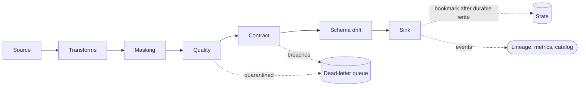

<p align="center">
  
</p>

<p align="center">
  <a href="https://crates.io/crates/faucet-stream"></a>
  <a href="https://docs.rs/faucet-stream"></a>
  <a href="https://faucet-hq.github.io/faucet-stream/"></a>
  <a href="https://github.com/faucet-hq/faucet-stream/actions/workflows/ci.yml"></a>
  <a href="https://codecov.io/gh/faucet-hq/faucet-stream"></a>
  <a href="https://crates.io/crates/faucet-stream"></a>
  <a href="rust-toolchain.toml"></a>
  <a href="deny.toml"></a>
  <a href="#license"></a>
  <a href="CHANGELOG.md"></a>
</p>

# faucet-stream

**ETL that governs your data while it moves.**

faucet-stream is a data-movement platform in a single native binary. It extracts from APIs,
databases, files and streams, transforms records in flight, and enforces masking, quality
checks, data contracts and data-flow policies *before* anything reaches the destination.
Then it loads into your warehouse, lake, database or queue, with resumable state, CDC and
effectively-once delivery built in.

You don't need to operate a platform, install a Python runtime or pay per row. Pipelines are
YAML files that you version, review and run from cron, CI or Kubernetes, or compile into your
own Rust service.

```bash
brew install faucet-hq/faucet-stream/faucet-cli
```

[Guide](https://faucet-hq.github.io/faucet-stream/) ·
[Your first pipeline](https://faucet-hq.github.io/faucet-stream/getting-started/first-pipeline.html) ·
[Connectors](https://faucet-hq.github.io/faucet-stream/reference/connectors.html) ·
[Config reference](https://faucet-hq.github.io/faucet-stream/reference/config.html) ·
[Benchmarks](BENCHMARKS.md) ·
[API docs](https://docs.rs/faucet-stream)

---

## A governed ETL pipeline in one file

This pipeline loads orders from a billing API into BigQuery every 15 minutes. Every row passes
the governance the analytics team relies on before anything is written.

- **Extract and load**
  - Reads only what changed since the last run, keyed on `updated_at`, with retries.
  - Merges into BigQuery by order id (`write_mode: upsert`), so an updated order replaces its old row.
- **Transform**
  - Converts keys to snake_case and casts `amount` to a number.
- **Govern in flight**
  - Hashes customer emails before any sink, dead-letter file or lineage event sees them.
  - Checks every row against quality rules and the contract the analytics team depends on.
  - Adds new source columns to the table instead of failing (`schema: evolve`).
  - Allows PII only into sinks marked `residency: eu`, which is checked before the run starts.
  - Sends rows that fail to a dead-letter file, and lets the rest of the run continue.
- **Run and control**
  - Runs on a 15-minute cron with `faucet schedule`, and skips a run if the previous one is still going.
  - Caps each run's rows and duration with a budget.
- **Observe and alert**
  - Serves Prometheus metrics on `127.0.0.1:9090/metrics` and sends traces to your OTLP collector.
  - Sends column-level lineage to OpenLineage, and records each dataset in a catalog for impact analysis.
  - Watches freshness with an SLA, and learns per-column profiles to spot drift.
  - Posts failures, SLA breaches, DLQ spikes and column drift to Slack.
- **Secure**
  - Reads credentials from AWS Secrets Manager and GCP Secret Manager, never from the file.

```yaml
# orders.yaml
version: 1
name: orders_to_warehouse

schedule:                                 # `faucet schedule orders.yaml` runs it every 15 minutes
  cron: "*/15 * * * *"
  overlap_policy: skip

policy:                                   # decided before any data moves
  version: 1
  classifications:
    - label: pii
      fields: [customer_email, phone]
  rules:
    - name: pii-stays-in-eu
      when: { label: pii }
      require: { residency: [eu] }

catalog:                                  # every dataset written, for lineage and impact analysis
  url: sqlite:./faucet-catalog.db

lineage:                                  # OpenLineage events with column-level lineage
  namespace: prod.warehouse
  include_column_lineage: true
  transport: { type: http, config: { url: "${env:OPENLINEAGE_URL}" } }

sla:                                      # freshness and volume, checked after every run
  max_staleness_secs: 3600
  min_rows_per_run: 1

profiling:                                # learned per-column baselines; drift is reported, not guessed
  on_drift: notify

budget:                                   # hard ceilings for a single run
  max_records: 5000000
  max_duration_secs: 1800

notifications:
  - name: data-alerts
    on: [run_failure, sla_breach, dlq_threshold, profile_drift]
    channel:
      type: slack
      config: { webhook_url: "${aws-sm:prod/faucet#slack_webhook}" }

observability:
  prometheus:
    listen: "127.0.0.1:9090"              # GET /metrics: rows, bytes, latency, errors, DLQ counts (unauthenticated, so bind locally)
  otel:
    endpoint: "${env:OTEL_EXPORTER_OTLP_ENDPOINT}"
    export: [traces, metrics]

pipeline:
  source:                                 # extract: only what changed since the last run
    type: rest
    config:
      base_url: https://api.example.com/v1
      path: /orders
      auth: { type: bearer, config: { token: "${aws-sm:prod/billing-api#token}" } }
      records_path: $.data[*]
      pagination: { type: Cursor, next_token_path: $.meta.next_cursor, param_name: cursor }
      replication_method: { type: Incremental }
      replication_key: updated_at
      primary_keys: [id]
      max_retries: 5

  transforms:                             # transform in flight
    - type: keys_case
      config: { mode: snake }
    - type: cast
      config: { fields: { amount: float }, on_error: "null" }

  masking:                                # PII is masked before any sink, DLQ or lineage event
    rules:
      - name: hash-emails
        match: { fields: [customer_email] }
        action: { type: hash }

  quality:                                # per-record and per-batch assertions
    record:
      - { type: not_null, field: id, on_failure: abort }
      - { type: compare, field: amount, op: gte, value: 0, on_failure: quarantine }
    batch:
      - { type: unique, fields: [id], on_failure: quarantine }

  contract:                               # the promise made to downstream consumers
    version: "1.0.0"
    owner: data-platform
    on_breach: quarantine
    allow_extra_fields: true
    fields:
      - { name: id, type: string }
      - { name: status, type: string, enum: [open, paid, refunded] }

  schema:                                 # new source columns are added to the table
    on_drift: evolve

  dlq:                                    # quarantined rows land here; the run keeps going
    sink: { type: file, config: { path: ./dlq/orders.jsonl } }
    max_failures_total: 1000              # ...unless too many fail

  sink:                                   # load: MERGE by id, so updated orders replace old rows
    type: bigquery
    attributes: { residency: eu }
    config:
      project_id: my-gcp-project
      dataset_id: analytics
      table_id: orders
      write_mode: upsert
      key: [id]
      auth:
        type: service_account_key
        config: { json: "${gcp-sm:projects/my-gcp-project/secrets/faucet-loader/versions/latest}" }

  state:                                  # bookmarks, so the next run resumes where this one stopped
    type: file
    config: { path: ./.faucet-state }
```

```bash
faucet validate --no-secrets orders.yaml   # in CI: grammar, types, policy verdict; no credentials needed
faucet validate orders.yaml                # also resolves every secret from the secrets managers
faucet doctor   orders.yaml                # probe auth, network and permissions on both ends
faucet test     tests/orders.yaml          # fixture tests of the transforms and checks; touches no real system
faucet plan --impact orders.yaml           # what will run, and which downstream datasets a schema change breaks
faucet run      orders.yaml                # run once: extract, transform, govern, load
faucet schedule orders.yaml                # or keep it running on the cron in the file
faucet status   orders.yaml                # one screen: last success, resume point, lag, DLQ backlog; exit 0/1/2
curl -s localhost:9090/metrics             # Prometheus metrics while it runs
faucet dlq inspect ./dlq/orders.jsonl                    # why rows were quarantined
faucet dlq replay --from ./dlq/orders.jsonl orders.yaml  # re-run them once fixed
faucet state export orders.yaml -o orders-state.json     # back up or move the bookmark; also show / set / reset / import
```

The [`cli/examples/`](cli/examples) directory has runnable configs for common
source-to-sink pairs and for each governance feature on its own.

**No infrastructure handy?** `./scripts/try-local.sh` builds a light binary, runs a governed
demo pipeline on generated data and opens the [web console](https://faucet-hq.github.io/faucet-stream/cookbook/web-console.html),
where you can browse runs, datasets and lineage. It needs no Docker and no cloud account
([details](https://faucet-hq.github.io/faucet-stream/getting-started/try-it-locally.html)).

## The data path

Every page of records takes the same route. Governance sits between the transform and the
write, so nothing reaches a destination until it has passed:


```mermaid
flowchart LR
    S[Source] --> T[Transforms] --> M[Masking] --> Q[Quality] --> C[Contract] --> D[Schema drift] --> K[Sink]
    Q -. quarantined .-> DLQ[(Dead-letter queue)]
    C -. breaches .-> DLQ
    K -. bookmark after durable write .-> ST[(State)]
    K -. events .-> L([Lineage, metrics, catalog])
```

Policies are checked before the run starts, and again at run time against the actual values.

## Governance in the data path

Most stacks add these as separate tools after the data has landed. In faucet each one is a
block in the pipeline file and applies to every connector.

| Guardrail | What it does | Guide |
|---|---|---|
| **PII masking** | Redact, hash, tokenize or partially mask fields, matched by name, pattern or value detector (emails, cards, …). Runs first, so raw PII never reaches a sink, the DLQ or a lineage event. | [masking](https://faucet-hq.github.io/faucet-stream/cookbook/masking.html) |
| **Data-quality checks** | 13 per-record and per-batch assertions: not-null, regex, ranges, sets, uniqueness, row counts, JSON Schema. Each can quarantine, abort or warn. | [quality](https://faucet-hq.github.io/faucet-stream/cookbook/quality.html) |
| **Data contracts** | A versioned, owned promise about output shape: types, nullability, enums, patterns and bounds, enforced per page. Export it as JSON Schema with `faucet contract`. | [contracts](https://faucet-hq.github.io/faucet-stream/cookbook/contracts.html) |
| **Data-flow policies** | Classify columns and declare which sinks each label may reach, for example "PII only to EU sinks" or "salaries only hashed". `validate`, `plan` and `doctor` report violations, and `run` refuses them. | [policies](https://faucet-hq.github.io/faucet-stream/cookbook/policies.html) |
| **Schema drift** | Detects added, removed and retyped columns per page, and then evolves the destination, quarantines or fails, according to the policy you set. | [schema drift](https://faucet-hq.github.io/faucet-stream/cookbook/schema-drift.html) |
| **Column profiling** | Learns per-column profiles (null rate, type mix, distinct counts, distributions) and reports statistically significant drift, with no thresholds to write. | [profiling](https://faucet-hq.github.io/faucet-stream/cookbook/profiling.html) |
| **SLA monitoring** | Declared freshness and volume floors, plus anomaly detection against learned baselines. | [SLA](https://faucet-hq.github.io/faucet-stream/cookbook/sla.html) |
| **Lineage and catalog** | OpenLineage events with schema and column-level lineage, sent over HTTP, file or Kafka, and a catalog of every dataset faucet has written. | [lineage](https://faucet-hq.github.io/faucet-stream/cookbook/lineage.html) · [catalog](https://faucet-hq.github.io/faucet-stream/cookbook/catalog.html) |
| **Change impact analysis** | With a `catalog:` block, as in the example above, `faucet plan --impact` walks the lineage graph and shows which datasets, contracts, owners and consumers a dropped or retyped column breaks, before the change ships. | [impact](https://faucet-hq.github.io/faucet-stream/cookbook/impact.html) |
| **Plan, approve, run** | Runs and template changes can require approval from named approvers. faucet re-plans before it executes, and every step is audited. | [approvals](https://faucet-hq.github.io/faucet-stream/cookbook/approvals.html) |
| **Cost and budgets** | Meters rows, bytes, round trips and connector cost signals per run, and enforces hard ceilings with a `budget:` block. | [usage](https://faucet-hq.github.io/faucet-stream/cookbook/usage.html) |
| **Verify and roll back** | Compares source and destination content with targeted repair, and undoes a bad load with `faucet rollback <run-id>`. | [verify](https://faucet-hq.github.io/faucet-stream/cookbook/verify.html) · [rollback](https://faucet-hq.github.io/faucet-stream/cookbook/rollback.html) |
| **Secrets** | `${vault:…}`, `${aws-sm:…}`, `${gcp-sm:…}` and `${azure-kv:…}` are resolved at load time and redacted from logs. | [secrets](https://faucet-hq.github.io/faucet-stream/cookbook/secrets.html) |

## Transform in flight

- **Record transforms**: `flatten`, `select`, `drop`, `rename_keys`, `keys_case`, `cast`, `set`, `coalesce`, `split`, `join`, `json_parse`, `redact`, `hash`, `cdc_unwrap`, and more ([transforms](https://faucet-hq.github.io/faucet-stream/cookbook/transforms.html)).
- **SQL on each page** with embedded DuckDB, for aggregations, filters and joins against lookup tables ([SQL transform](https://faucet-hq.github.io/faucet-stream/cookbook/sql-transform.html)).
- **Custom code** in any language that compiles to WebAssembly, sandboxed and run per record ([WASM transforms](https://faucet-hq.github.io/faucet-stream/cookbook/wasm-transforms.html)).

faucet transforms data while it moves. Modelling data that has already landed in the
warehouse is dbt's job, and the two work well together
([orchestration recipe](https://faucet-hq.github.io/faucet-stream/cookbook/orchestration.html)).

## Reliability you don't have to build

| Guarantee | How it works |
|---|---|
| **Bounded memory** | Sources stream page by page and sinks write each page as it arrives, so memory stays at one batch whatever the volume. |
| **Incremental and resumable** | Bookmarks are saved only after the page is durably written, to a file, Redis or Postgres. A crash replays at most the last page. State is versioned: after an upgrade, faucet migrates an older bookmark or refuses one it can't read, instead of silently re-syncing or skipping ([state](https://faucet-hq.github.io/faucet-stream/cookbook/state.html)). |
| **Effectively-once** | On supported sinks, a per-page commit token is written atomically with the data, so a resumed run writes no duplicates. This is idempotent at-least-once, not distributed-consensus exactly-once. |
| **Upsert and delete** | `write_mode: upsert \| delete` with a key and a delete marker ([upsert](https://faucet-hq.github.io/faucet-stream/cookbook/upsert.html)). |
| **Failure handling** | Retries with backoff and `Retry-After`, a circuit breaker, and a dead-letter queue you can inspect and replay. Each sink declares whether a failed batch is all-or-nothing, and `on_batch_error: dlq_all` is refused on sinks where a failed write may have partly landed, so replaying the DLQ can't duplicate rows ([resilience](https://faucet-hq.github.io/faucet-stream/cookbook/resilience.html) · [DLQ](https://faucet-hq.github.io/faucet-stream/cookbook/dlq.html)). |
| **Change data capture** | Row-level CDC from PostgreSQL, MySQL, SQL Server, MongoDB, Oracle (LogMiner) and DynamoDB Streams. `faucet mirror` runs a snapshot and hands it off to CDC without gaps, for one table or a whole table set ([replication](https://faucet-hq.github.io/faucet-stream/cookbook/replication.html)). |
| **Status and state** | `faucet status` shows each pipeline on one screen: last success or failure, where the next run resumes, how far a CDC or streaming source is behind, the DLQ backlog, and SLA and profiling verdicts. Exit codes 0 / 1 / 2 make it a cron or Nagios check. `faucet state show / set / reset / export / import` moves, resets, backs up or migrates a bookmark safely, including between file, Redis and Postgres stores ([state and status](https://faucet-hq.github.io/faucet-stream/cookbook/state-and-status.html)). |
| **Backfills** | Resumable, windowed historical replays with `faucet backfill` ([backfill](https://faucet-hq.github.io/faucet-stream/cookbook/backfill.html)). |
| **Observability** | Prometheus metrics and `tracing` / OTLP spans for every source, sink, transform and state operation, including source lag (`faucet_source_lag_seconds`, `_bytes`, `_events`) and API throttling (`faucet_source_throttled_total`, `faucet_source_throttle_wait_seconds`) ([observability](https://faucet-hq.github.io/faucet-stream/operations/observability.html)). |
| **Alerts** | Slack, PagerDuty or signed webhooks on run failures, SLA breaches, DLQ thresholds, open circuit breakers and column drift, with deduplication ([notifications](https://faucet-hq.github.io/faucet-stream/cookbook/notifications.html)). |
| **Testing** | `faucet test` runs fixture-based tests of a pipeline's transforms and checks offline, and `validate --no-secrets` checks configs in CI without credentials ([testing](https://faucet-hq.github.io/faucet-stream/cookbook/testing.html)). |

## Connectors

<!--COUNT:sources-->43<!--/COUNT--> sources and <!--COUNT:sinks-->35<!--/COUNT--> sinks. Every
connector depends only on `faucet-core`, so any source works with any sink.

| Category | Sources | Sinks |
|---|---|---|
| **Databases** | PostgreSQL, MySQL, SQL Server, Oracle, MongoDB, SQLite, DuckDB, Redis, DynamoDB, Spanner | PostgreSQL, MySQL, SQL Server, Oracle, MongoDB, SQLite, DuckDB, Redis, DynamoDB, Spanner |
| **CDC** | PostgreSQL, MySQL, SQL Server, MongoDB, Oracle, DynamoDB Streams | Applied through `write_mode: upsert` / `delete` on keyed sinks |
| **Warehouses and lakehouses** | BigQuery, Snowflake, Redshift, ClickHouse, Databricks, Delta, Iceberg | BigQuery, Snowflake, Redshift, ClickHouse, Databricks, Delta, Iceberg |
| **Object stores and files** | S3, GCS, Azure Blob, SFTP, local files (path, glob or URL), CSV, Parquet | S3, GCS, Azure Blob, SFTP, local files, CSV, Parquet, JSONL |
| **Streams and queues** | Kafka, Kinesis, Pub/Sub, NATS, RabbitMQ, SQS | Kafka, Kinesis, Pub/Sub, NATS, RabbitMQ, SQS |
| **APIs** | REST, GraphQL, gRPC, XML, Webhook, WebSocket | HTTP |
| **Search** | Elasticsearch | Elasticsearch |
| **Bridges** | Singer taps (experimental) | Singer targets (experimental), stdout |

- **Capabilities per connector** (streaming, resumable state, write modes, delivery guarantee, auth) are in the [connector matrix](https://faucet-hq.github.io/faucet-stream/reference/connectors.html). For help choosing between overlapping connectors, see [choosing a connector](https://faucet-hq.github.io/faucet-stream/reference/choosing.html).
- **File formats**: the file and object-store connectors read and write JSONL, JSON, CSV, Excel, XML, Parquet and Avro, and read ORC, chosen per file by extension or set explicitly ([file formats](https://faucet-hq.github.io/faucet-stream/cookbook/file-formats.html)).
- **Tier 1** connectors pass the [conformance battery](https://faucet-hq.github.io/faucet-stream/reference/conformance.html) in CI against a real backend or an official emulator.
- **SaaS sources** (CRM, payments, ticketing, advertising and analytics APIs) are maintained as declarative templates on the REST and GraphQL engines, not as separate crates. Browse the [Template Hub](https://faucet-hq.github.io/hub) and run one with `faucet run --source <owner>/<system> --sink faucet-hq/bigquery` ([guide](https://faucet-hq.github.io/faucet-stream/cookbook/template-hub.html)).

## Performance

These numbers are reproducible, and the [methodology](BENCHMARKS.md) includes the caveats.
Each workload moves 1M rows on one machine, compared with Meltano running the equivalent
Singer pipeline:

| Workload | Bottleneck | faucet | Meltano | Speed-up |
|---|---|---:|---:|---:|
| CSV → JSONL | parsing and serialization | 712k rows/s, 11.8 MiB | 7.4k rows/s, 724 MiB | ~96× |
| Postgres → JSONL | row decoding | 180k rows/s | 7.2k rows/s | ~25× |
| Postgres → Postgres | destination writes | 123k rows/s (`copy`) | 7.7k rows/s | ~16× |

For a realistic database-to-database move, quote **~16×**. Treat 96× as the upper bound,
because once the destination is the bottleneck the gap narrows.

## Run it the way you already run things

```bash
faucet run pipeline.yaml        # one run, then exit: cron, CI, a Kubernetes Job
faucet schedule pipeline.yaml   # built-in cron: DST-correct, overlap policies, graceful drain
faucet serve                    # HTTP control plane with a web console
```

- **`faucet run`** runs once and exits, which suits cron, CI and orchestrators like Airflow or Dagster ([orchestration](https://faucet-hq.github.io/faucet-stream/cookbook/orchestration.html)).
- **`faucet schedule`** is a built-in cron runtime ([scheduling](https://faucet-hq.github.io/faucet-stream/cookbook/scheduling.html)).
- **`faucet serve`** is a long-running control plane. It covers:
  - a REST API for submitting, polling and cancelling runs ([serve](https://faucet-hq.github.io/faucet-stream/cookbook/serve.html) · [HTTP API](https://faucet-hq.github.io/faucet-stream/reference/http-api.html))
  - event triggers on object arrival, webhooks and queue depth ([triggers](https://faucet-hq.github.io/faucet-stream/reference/triggers.html))
  - clustered execution ([cluster](https://faucet-hq.github.io/faucet-stream/cookbook/cluster.html))
  - an MCP server for agents ([MCP](https://faucet-hq.github.io/faucet-stream/cookbook/mcp.html))
  - multi-tenant embedding with per-tenant credentials, hosted OAuth and isolated state ([embedded integrations](https://faucet-hq.github.io/faucet-stream/cookbook/embedded-integrations.html))
- **Deployment**: a [Helm chart](deploy/helm/faucet-stream) and container images are provided ([deploying](https://faucet-hq.github.io/faucet-stream/operations/deploying.html)).

## Embed it in Rust

The CLI is a thin layer over a library, and the same engine is available through typed traits:

```rust
use faucet_stream::{Pipeline, RestStream, RestStreamConfig, PaginationStyle};
use faucet_stream::sink::file::{FileSink, FileSinkConfig};

#[tokio::main]
async fn main() -> Result<(), Box<dyn std::error::Error>> {
    let source = RestStream::new(
        RestStreamConfig::new("https://api.example.com", "/v1/users")
            .records_path("$.data[*]")
            .pagination(PaginationStyle::Cursor {
                next_token_path: "$.meta.next_cursor".into(),
                param_name: "cursor".into(),
            }),
    )?;
    let sink = FileSink::new(FileSinkConfig::new("./users.jsonl"))?;

    let result = Pipeline::new(&source, &sink).run().await?;
    println!("wrote {} records", result.records_written);
    Ok(())
}
```

- **Compile in only what you use.** Every connector is a Cargo feature, for example `--features source-postgres,sink-bigquery`.
- **Write your own connector.** Depend on `faucet-core`, implement `Source` or `Sink`, and publish it as `faucet-source-*` / `faucet-sink-*`. The [library tutorial](https://faucet-hq.github.io/faucet-stream/tutorials/library.html) and the [connector spec](docs/spec/faucet-connector-spec-v0.md) cover the contract, and `faucet-conformance` tests it.

## When not to use faucet

- **You need a long-tail SaaS connector today and don't want to write a template.** Airbyte and Meltano have far larger catalogs.
- **You want a hosted service that someone else operates.** Use Fivetran or Airbyte Cloud.
- **Your main job is modelling data already in the warehouse.** Use dbt: faucet gets the data there clean, and dbt models it.
- **You need a never-ending, record-at-a-time stream processor.** Use Redpanda Connect or Vector. faucet runs pipelines as discrete, resumable runs.

For detailed comparisons that are honest about where each tool wins, see
[vs. Meltano](https://faucet-hq.github.io/faucet-stream/comparison/meltano.html),
[vs. Airbyte](https://faucet-hq.github.io/faucet-stream/comparison/airbyte.html) and
[vs. Singer](https://faucet-hq.github.io/faucet-stream/comparison/singer.html).

## Install

```bash
brew install faucet-hq/faucet-stream/faucet-cli                  # macOS / Linux
curl -LsSf https://github.com/faucet-hq/faucet-stream/releases/latest/download/faucet-cli-installer.sh | sh
cargo install faucet-cli                                        # from source
cargo add faucet-stream                                         # as a library
```

Prebuilt archives with SHA-256 checksums are on the
[releases page](https://github.com/faucet-hq/faucet-stream/releases). The minimum supported
Rust version is 1.96. See the [installation guide](https://faucet-hq.github.io/faucet-stream/getting-started/installation.html)
for container images and slim builds. Prebuilt binaries cover macOS and Linux.

## Project

- [Roadmap](https://github.com/orgs/faucet-hq/projects/2): what's being built now and what's next.
- [Contributing](CONTRIBUTING.md) · [Changelog](CHANGELOG.md) · [Security policy](SECURITY.md)

## License

Licensed under either of [Apache License 2.0](LICENSE-APACHE) or [MIT](LICENSE-MIT), at your option.
