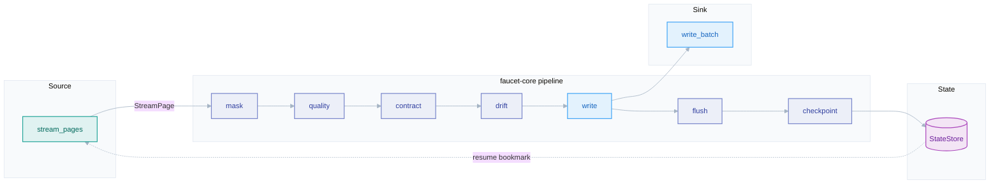
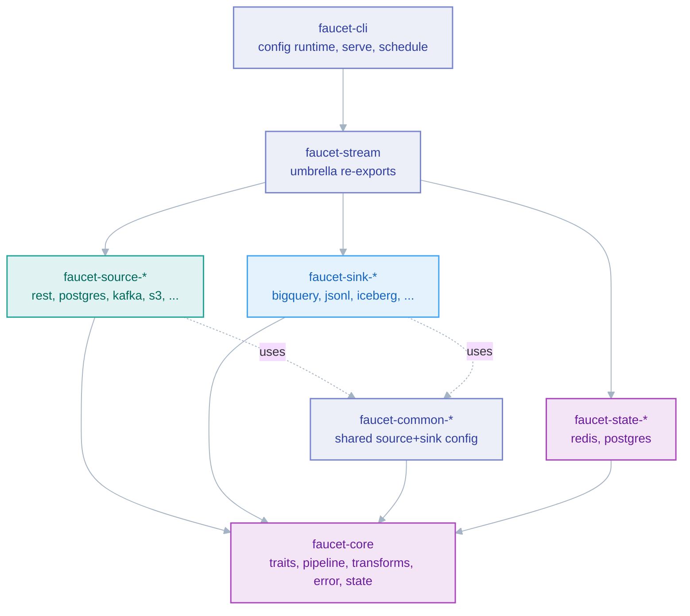

# Architecture overview

*The whole system on one page: crate topology, the data path, and the layering that keeps the core lean.*

## Why faucet-stream exists

faucet-stream moves data between systems — REST APIs, databases, object stores,
message queues, warehouses — declaratively, from a YAML/JSON config, with no Rust
code required to run a pipeline. Its stated Primary Goal is that
**every source and sink is as fast, efficient, and reliable as possible**;
reliability and correctness are not features layered on top, they are the reason
the library exists. That goal drives every architectural decision documented here.

## The data path

A run is, at its heart, one loop: pull a page of records from a source, protect
and validate it, write it to a sink, checkpoint, repeat.

The per-page passes and their fixed order are covered in [schema](./schema.md);
the loop itself in [pipeline](./pipeline.md); the streaming model in
[stream-pages](./stream-pages.md).

## Crate topology

The workspace is a Cargo workspace of <!--COUNT:crates-->106<!--/COUNT--> crates (<!--COUNT:libraries-->105<!--/COUNT--> libraries + the `faucet` CLI
binary). The topology encodes a hard rule: **connectors depend only on
`faucet-core`.**

- **`faucet-core`** — the only crate every connector depends on. Holds the
  `Source` / `Sink` / `StateStore` / `AuthProvider` traits, the pipeline engine,
  transforms, the schema/quality/contract/masking/drift passes, resilience, and
  `FaucetError`. Kept intentionally lean (see [ADR 0010](../adr/0010-pipeline-runtime.md)).
- **connector crates** (`faucet-source-*`, `faucet-sink-*`) — one external system
  each; the only place that performs protocol I/O.
- **`faucet-common-*`** — shared config types for a source+sink pair of the same
  system (auth, formats, TLS). See [extensibility](./extensibility.md).
- **state backends** — heavier `StateStore` implementations (Redis, Postgres) live
  in their own crates so `faucet-core` stays dependency-light.
- **`faucet-cli`** — the config-driven runtime: `run`, `validate`, `schema`,
  `serve`, `schedule`, `replicate`, `backfill`, and the matrix DAG executor.

The full crate table lives in `.claude/rules/architecture.md`.

## Layering: why orchestration lives above the core

`faucet-core` is a *library*, not a runtime. It knows how to move one source to one
sink and checkpoint safely — nothing about cron, HTTP control planes, matrix
DAGs, or clustering. Every orchestration concern (scheduling, `serve`, sharded
execution, snapshot→CDC handoff, backfill windows) is **CLI-layer code built on top
of `expand` + `executor`**, which in turn drive `Pipeline`. This keeps the core
embeddable by third parties and keeps orchestration churn out of the crate that 60+
connectors depend on. See [execution](./execution.md) and
[ADR 0010](../adr/0010-pipeline-runtime.md).

## The record model

Records are `serde_json::Value` end to end. This maximises connector-author
ergonomics (any JSON-shaped payload flows without a schema) at the cost of
per-record allocation and no columnar batching. The trade-off, and the path toward
Arrow, are in [ADR 0004](../adr/0004-json-record-model.md) and
[RFC 0002](../../rfcs/0002-arrow-support.md).

## Related

- [Execution model](./execution.md) · [Pipeline engine](./pipeline.md)
- [Connector SDK](./connector-sdk.md) · [Extensibility](./extensibility.md)
- [Design invariants](./invariants.md)
- [ADR 0004 — JSON record model](../adr/0004-json-record-model.md) · [ADR 0010 — Pipeline runtime](../adr/0010-pipeline-runtime.md)
- User guide: [Core concepts](../book/src/getting-started/concepts.md)
