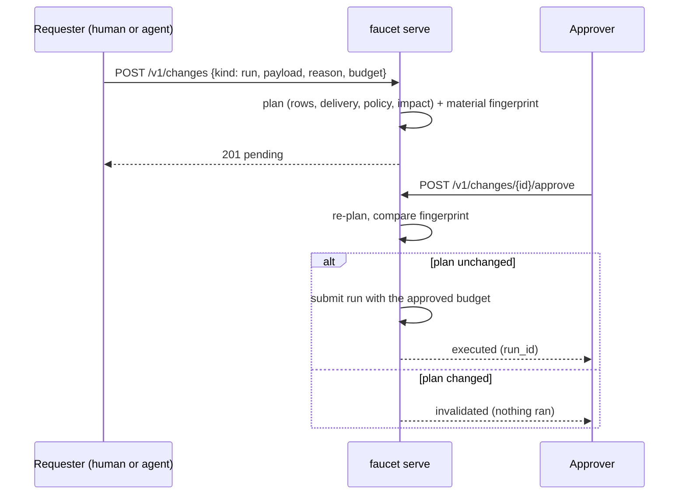

# Change approvals (plan → approve → run)

A **change request** is a proposed action — run a pipeline, register a
template version, launch a template version — that `faucet serve` stores with
its plan and executes only after an approver approves it. It is the review
step teams use for code, applied to data movement, and it is what makes the
control plane safe to hand to automation: an agent proposes over MCP, a human
approves in the console.



## Proposing

```bash
curl -X POST http://127.0.0.1:8080/v1/changes \
  -H "Authorization: Bearer $OPERATOR_TOKEN" \
  -H 'content-type: application/json' \
  -d '{
    "kind": "run",
    "payload": { "config": "version: 1\nname: orders\n...", "name": "orders-backfix" },
    "reason": "re-sync orders after the upstream fix",
    "budget": { "max_records": 5000000, "max_duration_secs": 1800 }
  }'
```

| `kind` | `payload` | What executes |
|---|---|---|
| `run` | a `POST /v1/runs` body | the run, as the requester, with the budget merged in |
| `template_register` | a `POST /v1/templates` body | the registration (and launch, when the body asks) |
| `template_launch` | `{ "id": "...", "version": 3 }` (version optional, default `newest`) | the launch |

The response is the stored request: `status: pending`, the plan (one
[`faucet plan`](../reference/cli.md#plan) report per root row — source, sink,
write mode, delivery guarantee, transforms, the [policy](./policies.md)
verdict and the [impact](./impact.md) severity — plus a summary), the budget,
how many approvals it needs and when it expires. A config that violates a
data-flow policy is refused here, before anyone is asked to approve it.

Two other ways in:

- **`POST /v1/runs` with `"require_approval": true`** (and an optional
  `reason` / `budget`) — the 202 body is `{ status: "pending_approval",
  change_id, change }` instead of a run. The console's Submit page has a
  *request approval* checkbox for this.
- **The MCP `propose_run` / `propose_template` tools** (on `faucet serve
  --mcp`) — an agent that holds `ChangeRequest` files a request as its
  principal and gets back the id and the plan summary to tell the human.

## Approving

```bash
curl -X POST http://127.0.0.1:8080/v1/changes/$ID/approve \
  -H "Authorization: Bearer $APPROVER_TOKEN" \
  -d '{ "comment": "matches the ticket" }'
```

Below the quorum the request stays `pending` with the approval recorded. At
the quorum faucet **re-plans** the payload against the world as it is now and
compares the material fingerprint — per row: source, sink, write mode,
delivery guarantee, transform chain, quality / contract / masking / drift
settings; for a launch, the target version and the version it replaces. If
anything material moved (a template version was launched in the meantime, the
default config now points somewhere else), the request becomes `invalidated`
with the difference spelled out and **nothing runs**: the approver reviewed
something else. A rotated secret or a live probe result is not material.

Otherwise the request executes and becomes `executed` (with `run_id` or the
template id and version) or, if execution itself errors, `failed` with the
reason. A run carries the label `change: <id>`.

`POST /v1/changes/{id}/reject` with `{ "reason": "..." }` rejects; the
requester may reject (withdraw) their own. A pending request lapses to
`expired` after its window (a sweep runs every minute, and reads apply it too).

## Who may approve

Reaching the approve / reject routes needs `ChangeApprove` (operator and up).
Which of those principals **count** is the `approvals:` block of
`--auth-config`:

```yaml
principals:
  - { name: alice, token: "${env:ALICE_TOKEN}", role: admin }
  - { name: bob,   token: "${env:BOB_TOKEN}",   role: operator }
  - { name: dave,  token: "${env:DAVE_TOKEN}",  role: operator }
approvals:
  expire_secs: 86400
  rules:
    - kinds: [run]
      roles: [operator, admin]
      min_approvers: 1
      self_approve: false
    - kinds: [template_register, template_launch]
      principals: [alice]
      roles: [admin]
      min_approvers: 2
```

The first rule whose `kinds` covers the request applies (an empty `kinds`
covers everything). `roles` and `principals` together say who counts; a named
principal counts whatever their role. `min_approvers` distinct principals must
approve. `self_approve: false` (the default) means the requester's own
approval is refused. With no rule for a kind, the default is **admins only,
one approval, no self-approval**. A refusal is a `403` that names the rule.

A server with a single principal (`--auth-token`, `--no-auth`) uses admin-only
with self-approval allowed — otherwise nothing could ever be approved there.

## Making it mandatory

```bash
faucet serve --auth-config auth.yaml --require-approval run,template_launch
```

- `run`: `POST /v1/runs` and template triggers answer with a pending change
  request instead of starting a run; `POST /v1/backfill` is refused (propose
  each window as a `run` change); the MCP `run_pipeline` tool points the agent
  at `propose_run`.
- `template_register` / `template_launch`: those kinds must come through
  `POST /v1/changes`.

`--approval-expiry-secs` sets the default window when the auth config does not.

## Budgets

The `budget` on a request (`max_records`, `max_bytes`, `max_duration_secs`,
`allowed_sinks`) is merged into the run with the config's own
[`budget:`](./usage.md#run-budgets) block — the stricter of each ceiling wins —
so an approved change can never move more than was agreed. The page that
would cross a record or byte ceiling is refused whole (the bookmark stays
put) and the run fails with `budget_exceeded`; an overwrite aborts cleanly
rather than leaving a half-written table.

## Notifications and audit

A run request whose config declares [`notifications:`](./notifications.md)
emits a `change_requested` event through those channels when it is proposed,
so the approvers hear about it where they already listen. A run stopped by a
budget emits `budget_exceeded`.

Every step is in the audit log: `change.requested`, `change.approved`,
`change.rejected`, `change.executed` (linked to the run), `change.invalidated`,
`change.expired`, `change.failed`.

## Console

The **Changes** page lists requests by status. Selecting one shows the plan
row by row, the budget, the approvals so far and — for principals holding
`change_approve` — the Approve and Reject controls. The server's policy still
decides; a refused approval shows its reason.

## Metrics

| Metric | Meaning |
|---|---|
| `faucet_serve_changes_total{kind,outcome}` | `requested`, `approved`, `denied`, `rejected`, `executed`, `invalidated`, `expired`, `failed`. |
| `faucet_serve_changes_pending` | Requests awaiting approval. |
| `faucet_budget_exceeded_total{pipeline,row,budget}` | Runs stopped by a budget ceiling. |
