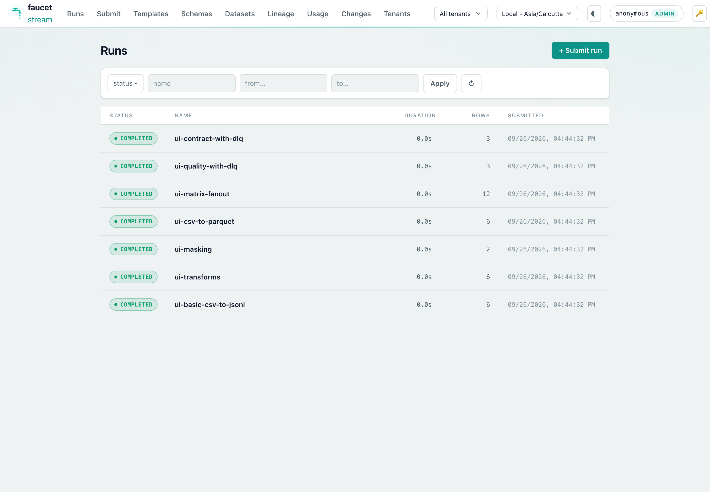
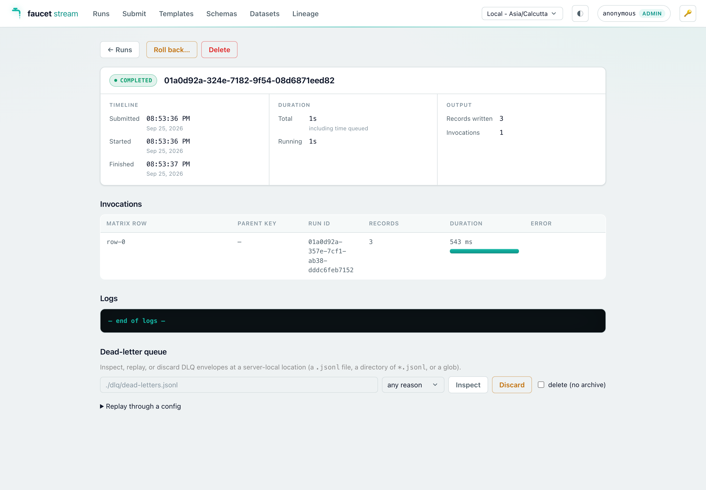
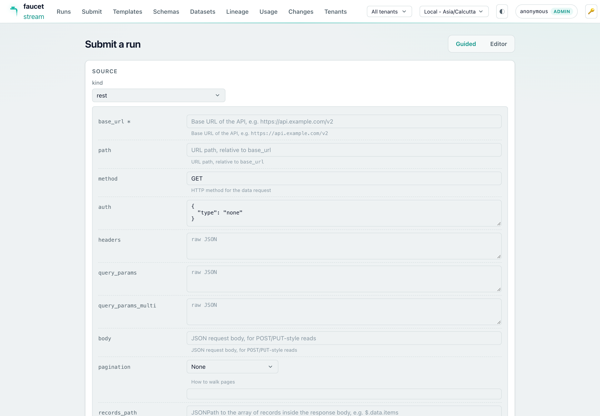
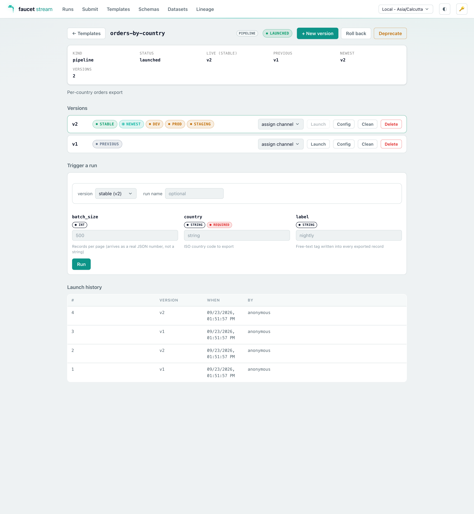
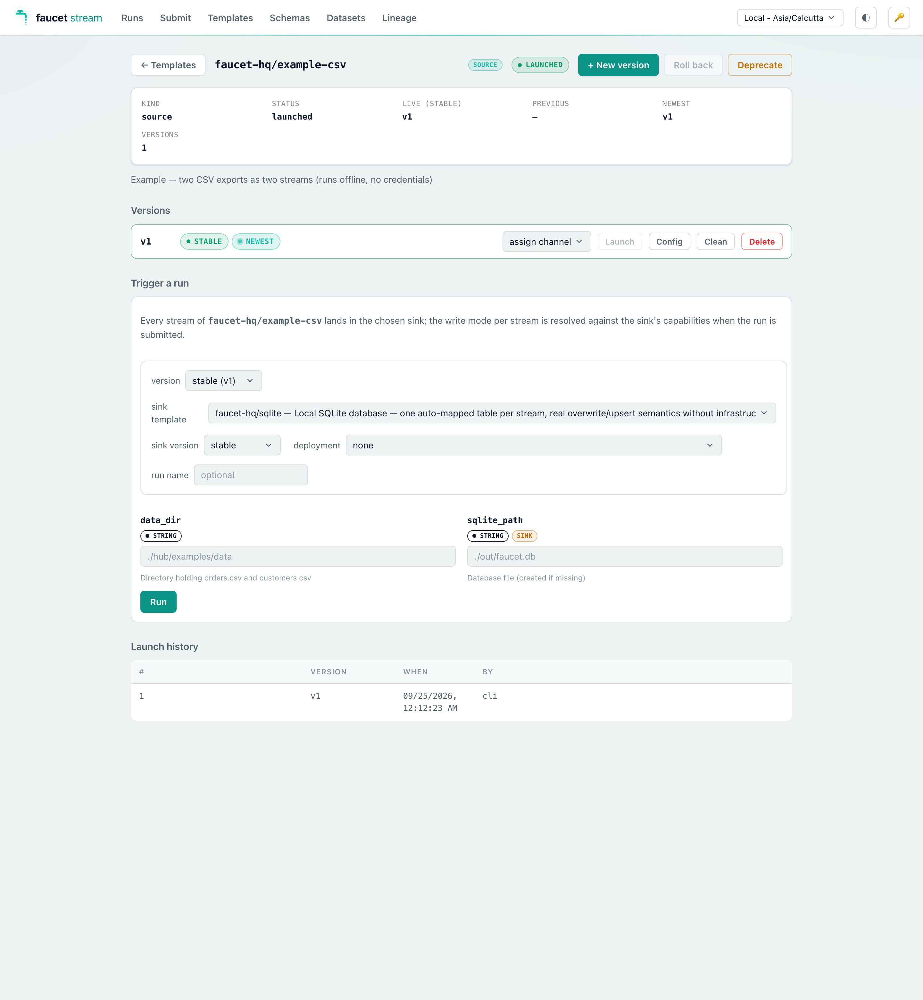
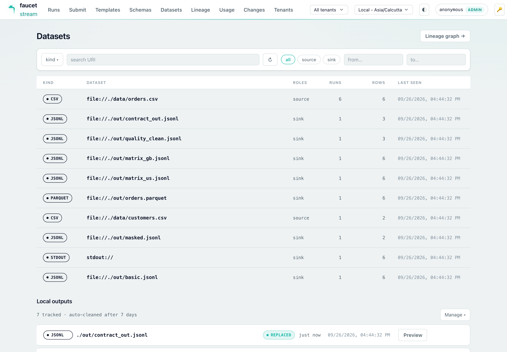
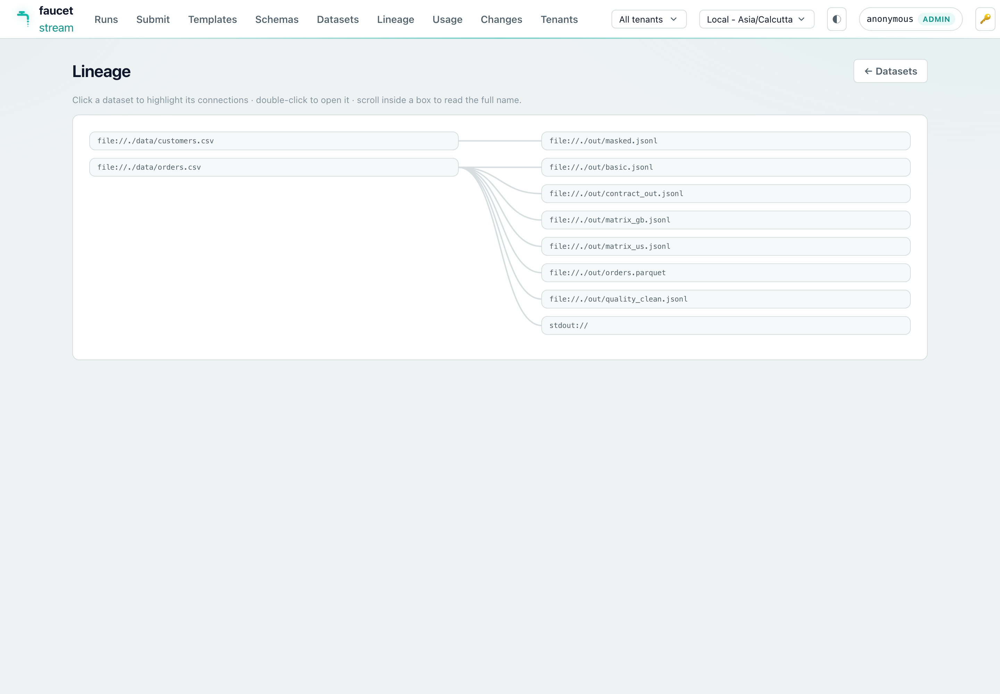

# Web console (`serve-ui`)

`faucet serve` optionally serves an embedded browser-based web console at `/`
when built with the `serve-ui` Cargo feature. The console gives you a visual
interface for the same HTTP API that `curl` or an orchestrator would use —
useful for ad-hoc runs, browsing logs, and exploring connector schemas without
leaving a browser tab.

> The console is a thin static single-page application bundled into the binary
> via `rust-embed`. There is no separate deployment and no network call during
> startup.

> **Want to see it populated in one command?** The
> [Try it locally](../getting-started/try-it-locally.md) quickstart builds the
> CLI, runs a battery of demo pipelines, and leaves this console up with Runs,
> Datasets, Lineage, and Templates already filled in — the screenshots below are
> from it.

## Enabling the feature

```bash
# Install with the embedded console (add serve-ui to your --features list)
cargo install faucet-cli --features serve-ui

# Or build locally
cargo build -p faucet-cli --features serve-ui
```

`serve-ui` implies `serve`, so you do not need to list both. The `full`
aggregate already includes `serve-ui`.

Once built, start the server normally:

```bash
FAUCET_SERVE_AUTH_TOKEN=s3cret faucet serve --listen 127.0.0.1:8080
```

Then open `http://127.0.0.1:8080/` in a browser.

## Token flow

The static shell at `/` is served **without authentication** so the browser can
load the page before it has a token. All `/v1` API calls that populate the
console's data are bearer-gated as usual.

On first load (or after a 401) the console prompts you to paste the bearer
token (the same value as `FAUCET_SERVE_AUTH_TOKEN` / `--auth-token`). The token
is stored in browser `localStorage` and sent as `Authorization: Bearer <token>`
on every subsequent `/v1` request. A key-icon button in the top bar lets you
update or clear it at any time.

> **Security:** the bearer token is as sensitive as the API itself — anyone who
> obtains it can submit arbitrary pipeline configs with the server's identity
> (see the [security model](./serve.md#️-security-model--read-before-exposing)).
> Serve the console only over localhost or a TLS-terminating proxy; never paste
> a production token into a browser tab on a shared machine.

## Views

### Runs dashboard

Lists all runs with live status badges. You can:

- Filter by name, status, or time range.
- Page through history.
- Click any row to open the run detail view.
- Click **+ Submit run** to go directly to the Submit view.



### Run detail

Shows the full run record (status, timestamps, labels, config) plus every
invocation in the matrix. For in-flight runs it streams structured log events
live via SSE (the same `GET /v1/runs/{id}/logs` endpoint). You can cancel or
delete a run from this view.

It also embeds a **dead-letter-queue panel** — enter a server-local DLQ location
(a `.jsonl` file, a directory, or a glob), then **Inspect** it (grouped by
reason), **Discard** envelopes (optionally archiving first), or **Replay
through a config** — paste a pipeline config and re-feed the quarantined
payloads through its transforms / quality / contract / sink, with a dry-run
toggle. This is the [DLQ replay](./dlq.md) workflow, in the browser (backed by
`POST /v1/dlq/{inspect,replay,discard}`).



### Submit

Two modes for submitting a new pipeline run:

- **Raw editor** — paste or type YAML/JSON directly into a text area. The same
  format accepted by `POST /v1/runs`.
- **Schema wizard** — select a source and sink from the compiled connector list,
  fill in the generated form fields, and the wizard assembles a valid config.
  The form is derived from the same JSON Schemas returned by
  `GET /v1/schemas/{kind}/{name}`.



### Schemas explorer

Browses the connector catalog compiled into the running server
(`GET /v1/schemas`). Click any source, sink, or transform to view its full
JSON Schema — useful for checking config field names and types without leaving
the browser.

### Templates

When the server is built with the `templates` feature, a **Templates** view browses
the [template registry](./templates.md) in the `--history` backend. Every row
carries a **kind** pill — `source` (a system and its streams), `sink` (a
destination), `deployment` (the operational blocks — state, DLQ, notifications,
SLA — applied over a composed run), or `pipeline` (a complete config) — beside its lifecycle status
(`draft` / `launched` / `deprecated`), which version is live, the build tip, and
its parameter count. Chips filter by status and by kind (deprecated templates are
hidden until their chip is toggled on). As soon as the registry holds a source
template and a sink template, a **Compatibility** grid sits above the list —
one row per source, one column per sink, ✓ where every stream has a write mode
the sink supports (the tooltip lists the per-stream plan); clicking a cell opens
the source's page with that sink preselected in its trigger form:


Clicking one opens its **versions page** — the release console for that template:

- one row per stored version, with the channels currently pointing at it
  (`stable` / `previous` / `newest` derived, `dev`…`prod` assigned) and an
  **assign-channel** dropdown
- **Launch** on any version (disabled on the live one), **Roll back** to the
  previous launch, and **Deprecate** / **Revive**
- **Config** to expand the stored body verbatim, and **Delete** for one version
- a **Trigger a run** form generated from the template's declared `params:` —
  typed inputs, required/secret badges, descriptions — plus a version selector
  listing only channels that actually resolve
- the **launch history**: who blessed which build, and when



A **source template**'s page adds a **sink template** selector (plus its version
channel) to the trigger form: the chosen sink's params join the form, tagged
`sink`, and the run composes the two at submit time — the same source can be
sent to BigQuery today and Postgres tomorrow from one page. A **deployment**
selector applies a registered [deployment overlay](./template-hub.md#deployment-overlays)
to the run; its params join the form tagged `deployment`. A **sink template**'s
or **deployment**'s page has no trigger form; it lists the source templates it
can be used with.



When the server was started with `--templates-sync`, the Templates page also
shows **Sync from origins**: the configured remote origins (repo or bucket,
prefix, launch / prune policy), a **Dry run** that lists exactly what a pull
would register, launch, deprecate, or skip, and **Pull now** to apply it — see
[Hosting templates in a repo or bucket](./templates.md#hosting-templates-in-a-repo-or-bucket-sync).

Registering is in the UI too — **Register a template** opens an editor with `id` /
format / description and a **launch it** checkbox, so a template can go from
config to live without leaving the browser.

### Datasets & Lineage (Data Movement Catalog)

When the server is built with the `catalog` feature, two more views browse the
[Data Movement Catalog](./catalog.md) accumulated in the `--history` backend:

- **Datasets** — a filterable list (kind / URI search) of every dataset the
  server's pipelines have touched. Clicking a dataset opens its detail:
  freshness and run counters, per-run volume bars, the deduplicated schema
  timeline with per-version diff badges, and its upstream/downstream edges.

  

- **Lineage** — the source→sink edge graph rendered as a layered SVG (sources
  left, sinks right). Hover an edge for the pipeline/run context; click a node
  to open its dataset detail; open a rooted, depth-bounded slice from any
  dataset's detail page.

  

On a server built without the `catalog` feature both views show a short
"not available" notice (the endpoints are absent).

### Cleaning up local outputs

The Datasets page is also where the **local files** the server's sinks wrote
(jsonl / csv / parquet) are listed and reclaimed — cleanup of *data artifacts*
belongs next to the data artifacts, not on the Runs tab, which is about execution
history. A **Local outputs** panel sits under the dataset list (and under each
dataset's detail, scoped to it) showing every tracked file with its age and state:

| State | Meaning |
|---|---|
| `present` | on disk |
| `expired` | already cleaned — the file is gone, the record is kept |
| `external` | faucet wrote this file but did not create it, so it is never cleaned |

Controls, when your role holds `LocalOutputManage` (`operator` and up — a
`viewer` sees the list and no buttons):

- **Delete now** on any `present` output.
- **Purge older than N days**, prefilled with the server's configured window.
- **Clean all local outputs** — behind a confirm, because it also removes files
  still inside their retention window. On a dataset's detail page the same button
  is scoped to that dataset.

The model to keep in mind: **data artifacts are disposable; run history is
durable.** Cleaning an output removes the *file* — the run record is untouched,
so the Runs tab still shows what ran, and the output re-renders as `expired`
rather than as a broken row. Only files faucet created are ever deleted (never a
glob, never a directory); a skipped file always comes with the reason, so a "0
files" result never looks like a broken button. The same operations run
automatically on a timer — see
[Local output retention](../reference/cli.md#local-output-retention).

### Previewing what a run actually wrote

"12 records written" tells you the run finished. It does not tell you whether the
transform did what you meant. On a server started with
`--preview-local-outputs`, each tracked jsonl / csv / parquet output in the
**Local outputs** panel grows a **Preview** button: it expands inline and renders
the file's first rows as a table, with a row-count input bounded by the server's
own cap.

500 rows load by default; the row box takes any number up to the server's
ceiling, and **All rows** asks for the whole dataset:

```bash
# Local iteration loop: previews on, 500 rows by default, ceiling at 5000.
FAUCET_SERVE_AUTH_TOKEN=s3cret faucet serve --preview-local-outputs

# …and with no ceiling, so "All rows" really loads the whole file.
FAUCET_SERVE_AUTH_TOKEN=s3cret faucet serve \
  --preview-local-outputs --preview-max-rows 0
```

What the table shows:

- **Columns** are the union of the records' fields, so a field only some records
  carry still gets a column — a preview never hides something that was written.
- A **missing** field renders `—` and a `null` one renders `null`; they are
  different facts about the record.
- The status line always says which it is: "*whole dataset*", or "*stopped at the
  row limit — the dataset has more*". 500 rows of a million-row file can never be
  mistaken for the file, and a complete read says so rather than leaving you to
  infer it from the absence of a warning.
- A record that is not a JSON object (a bare scalar or array per line — legal
  NDJSON) is rendered across the row rather than as a line of blanks.

Under the hood it is a **source-backed capped read**: the server reads the output
back through the matching *source* connector and stops once it has enough rows,
so previewing a huge file touches only its first pages. There is no paging —
these files are sequential streams with no row index, so "show me more" is just a
larger limit, which is why the panel has a row box and an **All rows** button
instead of *Next page*.

**On a server with a ceiling, "All rows" gives you the ceiling** (the status line
says it stopped at the row limit). An uncapped server gives you everything — and
still stops at a 64 MiB response budget or a 30-second deadline if the dataset is
larger than that, saying which. A partial answer always names the bound that
produced it.

Only a `present` output gets a Preview button. An `expired` one has no file left,
and an **`external`** one — a file faucet wrote to but did not create — is never
previewed: its contents are not faucet's to serve, which is the read-side twin of
the retention GC's refusal to delete it. Each served preview is recorded in the
audit log as `local_output.preview`.

**It is off by default and intended for local testing** — it returns file
*contents* over HTTP, and reading needs only `LocalOutputRead` (`viewer` and up),
so enabling it lets every viewer see the data those pipelines wrote. Without the
flag no Preview button is rendered at all (the list response says the capability
is off), and a direct API call is refused with a `403` naming the flag. A preview
of an output that retention already cleaned shows the "cleaned up — the run
record is kept" message in place of the table, never an error toast. Full detail:
[Dataset preview](../reference/cli.md#dataset-preview-of-local-outputs).

## Disabling the console at runtime

If you built with `serve-ui` but want to serve only the API (no static assets),
pass `--no-ui`:

```bash
FAUCET_SERVE_AUTH_TOKEN=s3cret faucet serve --no-ui
```

`/` and `/assets/*` return 404; the `/v1` API and the unauthenticated probes
(`/healthz`, `/readyz`, `/metrics`) are unaffected.

## New API endpoints

The `serve-ui` feature ships three new bearer-gated endpoints that the console
(and any other client) can call:

| Method | Path | Description |
|--------|------|-------------|
| `GET` | `/v1/schemas` | Catalog of all compiled sources, sinks, transforms, and state-store kinds. |
| `GET` | `/v1/schemas/{kind}/{name}` | JSON Schema for one connector or transform (`kind` ∈ `source`/`sink`/`transform`). Returns 404 for unknown kind or name. |
| `POST` | `/v1/doctor` | Validate and probe a submitted config without running it. Returns 200 (all probes pass) or 422 (any probe fails) with a probe report. Request body: `{ "config": "<yaml-or-json>", "config_format": "yaml" }`. |

With the `catalog` feature the console also drives the local-output endpoints —
`GET /v1/local-outputs`, `DELETE /v1/local-outputs/{id}`,
`POST /v1/local-outputs/cleanup`, and (with `--preview-local-outputs`)
`GET /v1/local-outputs/{id}/preview` — documented in the
[HTTP API reference](../reference/http-api.md#local-sink-outputs).

These endpoints require the `serve` feature and are available at runtime
regardless of whether `--no-ui` was passed.

## Related pages

- [Running faucet as a service](./serve.md) — the full `faucet serve` guide.
- [HTTP API reference](../reference/http-api.md) — complete endpoint/schema reference.
- [`faucet serve` CLI flags](../reference/cli.md#serve) — all `faucet serve` flags.
