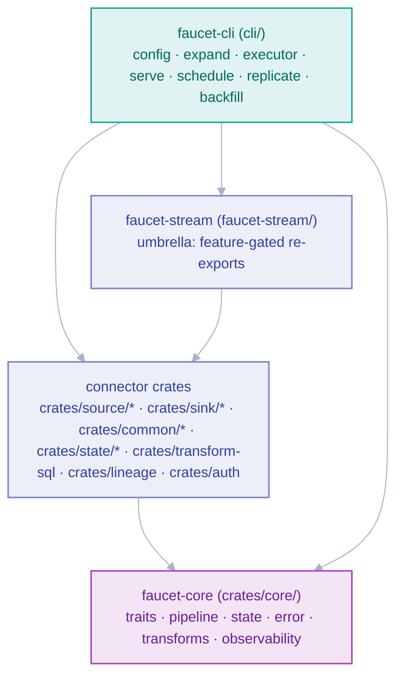

# Contributor's map of the codebase

*Where everything lives, and the order to read it in when you're tracing a record from config to sink.*

This page orients a new contributor inside the workspace. It is deliberately a
*map*, not a spec — for the "why" behind each subsystem, follow the links into
[`docs/architecture/`](../architecture/README.md). For build/test/PR mechanics,
see the top-level [`CONTRIBUTING.md`](../../CONTRIBUTING.md).

## Workspace shape

faucet-stream is a Cargo workspace of <!--COUNT:crates-->95<!--/COUNT--> crates. They fall into four layers,
and the dependency direction only ever flows downward:

The invariant that keeps the ecosystem healthy: **every connector crate depends
only on `faucet-core`.** A connector never depends on another connector, on the
umbrella, or on the CLI. This is what lets a third party publish a
`faucet-source-foo` crate against `faucet-core` alone. See
[extensibility](../architecture/extensibility.md) and the
[connector spec](../spec/faucet-connector-spec-v0.md).

## Which crate holds what

| You're looking for… | It lives in… |
|---|---|
| The `Source` / `Sink` / `StateStore` traits, `FaucetError`, `Pipeline`, `run_stream` | `crates/core/` — see [`traits.rs`](../../crates/core/src/traits.rs), [`pipeline.rs`](../../crates/core/src/pipeline.rs), [`state.rs`](../../crates/core/src/state.rs), [`error.rs`](../../crates/core/src/error.rs) |
| Record transforms, quality, contracts, masking, drift, resilience, idempotency | `crates/core/src/{transform,stage,quality,contract,masking,drift,resilience,idempotency}.rs` (and their sub-modules) |
| Automatic metrics/tracing decorators | `crates/core/src/observability/` |
| A specific connector's I/O | `crates/source/<name>/src/stream.rs` or `crates/sink/<name>/src/sink.rs` |
| A connector's config shape | `crates/{source,sink}/<name>/src/config.rs` |
| Shared config for a source+sink pair | `crates/common/<name>/` (e.g. `faucet-common-kafka`) |
| Config parsing, matrix expansion, execution | `cli/src/{config,expand,executor}.rs` |
| Connector dispatch + plugin registry | `cli/src/registry.rs` |
| The CLI verbs (`run`, `validate`, `doctor`, `test`, …) | `cli/src/commands/` |
| The HTTP control plane | `cli/src/serve/` |
| The connector inventory used by the CLI's `registry_index` test | [`cli/connectors/registry.json`](../../cli/connectors/registry.json) |

The authoritative, always-current crate table is in
`.claude/rules/architecture.md`.

## Read-order: tracing one record end to end

When you need to understand how a record actually moves, read the layers in the
order the data does. Each hop below has a "start here" file:

1. **Config** — `cli/src/config.rs` defines `PipelineConfig`; `interpolate.rs`,
   `compose.rs`, and `secrets/` resolve `${…}` references at load time.
2. **Expansion** — `cli/src/expand.rs` turns the config (plus any `matrix:`) into
   a list of `ExpandedNode`s and runs every config-load gate (exactly-once,
   write-mode, quarantine-requires-DLQ). This is where a bad config is rejected
   *before* any I/O.
3. **Execution** — `cli/src/executor.rs` builds the concrete source/sink via
   `cli/src/registry.rs`, wires the `RunStreamOptions`, and drives each node
   under a bounded semaphore.
4. **Core pipeline** — `Pipeline::run` (in [`pipeline.rs`](../../crates/core/src/pipeline.rs))
   resolves the bookmark, then calls `run_stream`. This is the heart of the
   system; the [pipeline](../architecture/pipeline.md) and
   [stream-pages](../architecture/stream-pages.md) docs explain it in full.
5. **Connector I/O** — the source's `stream_pages` yields
   [`StreamPage`](../architecture/stream-pages.md)s; the sink's `write_batch`
   commits them.

The single most important thing to internalize before touching the write path:
**a page's bookmark is persisted only *after* the sink has durably written and
flushed that page** (write → flush → `StateStore::put`, in `run_stream`). This is
the ordering that makes crashes safe. See
[checkpoint-ordering ADR](../adr/0002-checkpoint-ordering.md).

## Where to go next

- Adding a connector → [connector-authoring](./connector-authoring.md)
- Writing tests → [testing](./testing.md)
- Making it fast → [performance](./performance.md)
- Something's broken → [debugging](./debugging.md)
- Avoiding the classic traps → [common-mistakes](./common-mistakes.md)

## Related

- [Architecture overview](../architecture/overview.md)
- [Execution model](../architecture/execution.md)
- [Pipeline runtime](../architecture/pipeline.md)
- [Extensibility & plugins](../architecture/extensibility.md)
- [Engineering principles](../engineering-principles.md)
- [Top-level CONTRIBUTING.md](../../CONTRIBUTING.md)
