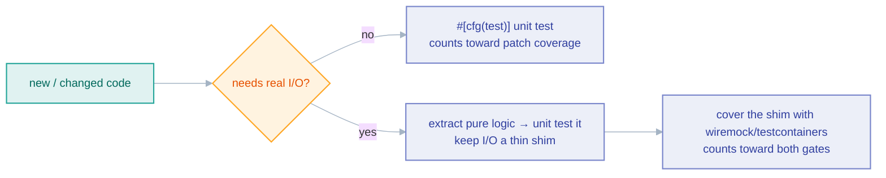

# Testing

*What to test, where it lives, and why the 95% patch-coverage gate is a floor, not a target.*

Untested public API surface is a liability. This page covers the philosophy and
the practical techniques; the repository-wide conventions are in
[`docs/standards/testing.md`](../standards/testing.md), and the PR mechanics are
in [`CONTRIBUTING.md`](../../CONTRIBUTING.md).

## Two kinds of test, two homes

- **Unit tests** live in `#[cfg(test)]` modules at the bottom of the source file
  they exercise. Use them for anything that doesn't need real I/O: pagination
  state transitions, JSONPath extraction, auth-header generation, config
  validation, error/`match` branches. This is the bulk of the suite.
- **Integration tests** live in the crate's `tests/` directory. HTTP connectors
  use [`wiremock`](https://docs.rs/wiremock); database/queue connectors use
  [`testcontainers`](https://docs.rs/testcontainers) (these need Docker and are
  CI-gated).

There is a third kind that is neither: the **engine guarantee suites** in
`crates/conformance/tests/reliability_*.rs`. A guarantee like "the bookmark is
persisted only after the sink confirms" is a property of the *order* in which
the engine calls two collaborators, which neither a pure unit test nor a
per-connector test can observe. Those suites drive the real `Pipeline::run`
against doubles that fail at one named boundary and assert on the recorded event
sequence. They are Docker-free, run in seconds, and are a **required** CI check.
See [Reliability testing](../book/src/operations/reliability-testing.md) for the
tier map and how to add a guarantee.

## The coverage gates

The **required `Coverage` job** runs every test in the workspace under
`cargo-llvm-cov` — unit tests *and* the Docker-backed integration tests in each
crate's `tests/` directory — and enforces two gates on the lines a PR changes:

| Gate | Script | Measures | Floor |
|---|---|---|---|
| Patch coverage | `scripts/patch-coverage.py` | changed lines hit by **any** test | 95% |
| Integration coverage (#695) | `scripts/integration-coverage.py` | changed **I/O** lines hit by an **integration** test | 60%, and every changed I/O file ≥ 1 line |

The job runs the integration binaries first and reports them on their own, then
the unit tests, then merges both — every test still runs once. The unit-only and
integration-only halves are uploaded to Codecov under the `unit` and
`integration` flags. Both gates print the uncovered lines when they fail; the
integration gate also writes a per-file table to the job summary.

**Why two gates.** Patch coverage alone lets a new sink method pass with a unit
test that never talks to a database. The integration gate closes that: code in
`crates/{source,sink,common,state}/*/src/` (except `config.rs`),
`cli/src/serve/`, `cli/src/executor.rs`, `cli/src/templates/` and `cli/src/hub/`
must run in a test against a real backend (a testcontainer, `wiremock`, or an
emulator). Lines inside `#[cfg(test)]` modules are not counted — they cannot run
in an integration binary.

**The escape hatch.** When a change genuinely cannot be tested against a backend
(a paid SaaS API with no sandbox, a signal handler), put this line in the PR
description:

```
no-integration-test: <why>
```

A failure then becomes a warning, and the reason appears in the job log and
summary — visible, never silent. Docs-, console- and Helm-only PRs skip the
whole coverage job, gates included.

(`codecov/patch` reports a number too, but it is **not** a required check and
posts unreliably — which is why both gates live inside the job itself.)

Treat 95% as the floor, not a target. If a line "can't" be tested, that is
usually a design smell — extract the pure logic and make the I/O a thin shim:



Genuinely untestable surface (a SIGTERM handler, a `main()` dispatch arm, an
infinite supervisory loop) is the only sanctioned exception — keep it to the few
unreachable lines and say so in the PR.

Verify locally before pushing, so neither gate surprises you (bash):

```bash
cargo llvm-cov clean --workspace && rm -f target/*.profraw
eval "$(cargo llvm-cov show-env --sh)"
cargo test -p <crate> --all-features --test '*'
cargo llvm-cov report --lcov --output-path integration.lcov
mkdir -p target/i && mv target/*.profraw target/i/
cargo test -p <crate> --all-features --lib --bins
cargo llvm-cov report --lcov --output-path unit.lcov
mv target/i/*.profraw target/ && cargo llvm-cov report --lcov --output-path lcov.info
python3 scripts/patch-coverage.py --lcov lcov.info --base origin/main --min 95
python3 scripts/integration-coverage.py --lcov integration.lcov --unit-lcov unit.lcov --base origin/main
```

## Techniques worth knowing

- **Offline pool tests.** You can unit-test a pool-backed SQL source *without*
  Docker using `sqlx`'s `connect_lazy` (plus a short `acquire_timeout`): the
  pool is created but never connects until first use, so you can exercise query
  building, identifier quoting, and config paths offline. (This does **not** work
  for MSSQL/`tiberius`, whose `bb8` pool connects eagerly.)
- **TUI / terminal paths.** Interactive code never runs in CI, so render it
  through `ratatui`'s `TestBackend` and split the drive-loop from the crossterm
  setup so the loop is testable.
- **Spawned-binary tests** need a `CARGO_LLVM_COV` skip-guard, or they fail under
  the instrumented coverage run.

## Rules

- **Assert the specific outcome, not "no panic".** A test that only checks the
  call didn't panic proves almost nothing.
- **New code always gets tests** — non-negotiable.
- **Do not blindly update an existing test to make it pass.** If your change
  breaks a test, investigate *why* first — silently rewriting the assertion to
  match new behavior is how a regression sails through. Modified tests deserve
  the same scrutiny as modified code.
- **Watch feature unification in assertions.** `serde_json::Map` iteration order
  flips between `BTreeMap` and `IndexMap` depending on the `preserve_order`
  feature, which `--all-features` turns on. Assert the *set* of keys, not the
  *sequence*, or your test passes under `-p crate` and fails in CI.

## Related

- [Reliability testing](../book/src/operations/reliability-testing.md)
- [Testing standards](../standards/testing.md)
- [Debugging](./debugging.md)
- [Common mistakes](./common-mistakes.md)
- [Performance](./performance.md)
