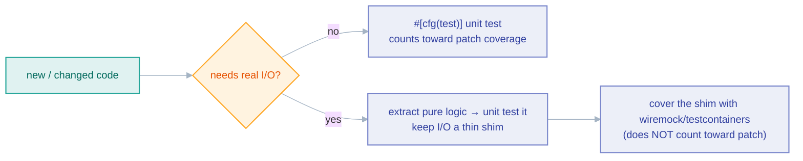

# Testing

*What to test, where it lives, and why the 95% patch-coverage gate is a floor, not a target.*

Untested public API surface is a liability. This page covers the philosophy and
the practical techniques; the repository-wide conventions are in
[`docs/standards/testing.md`](../standards/testing.md), and the PR mechanics are
in [`CONTRIBUTING.md`](../../CONTRIBUTING.md).

## Two kinds of test, two homes

- **Unit tests** live in `#[cfg(test)]` modules at the bottom of the source file
  they exercise. Use them for anything that doesn't need real I/O: pagination
  state transitions, JSONPath extraction, auth-header generation, config
  validation, error/`match` branches. This is the bulk of the suite.
- **Integration tests** live in the crate's `tests/` directory. HTTP connectors
  use [`wiremock`](https://docs.rs/wiremock); database/queue connectors use
  [`testcontainers`](https://docs.rs/testcontainers) (these need Docker and are
  CI-gated).

There is a third kind that is neither: the **engine guarantee suites** in
`crates/conformance/tests/reliability_*.rs`. A guarantee like "the bookmark is
persisted only after the sink confirms" is a property of the *order* in which
the engine calls two collaborators, which neither a pure unit test nor a
per-connector test can observe. Those suites drive the real `Pipeline::run`
against doubles that fail at one named boundary and assert on the recorded event
sequence. They are Docker-free, run in seconds, and are a **required** CI check.
See [Reliability testing](../book/src/operations/reliability-testing.md) for the
tier map and how to add a guarantee.

## The coverage gate

Changed lines must be **≥95% covered**. The gate that enforces it is the
`patch-coverage` step inside the **required `Coverage` job**, which computes the
number deterministically from the run's own lcov (`scripts/patch-coverage.py
--min 95`) and prints the uncovered lines when it fails. Treat 95% as the
floor, not a target.

(`codecov/patch` reports the same number but is **not** a required check and
posts unreliably — it cannot be the gate, which is why the check lives in the
job itself. Measure locally before pushing; nothing else will catch a
sub-95% patch for you.)

The critical subtlety: **Docker-backed integration tests do not count toward
patch coverage.** The coverage run is not instrumented with the containers, so
lines only exercised by a `testcontainers` test show as uncovered. **Unit-test
your changed lines.** If a line "can't" be unit-tested, that is usually a design
smell — extract the pure logic and make the I/O a thin shim:



Genuinely untestable surface (a SIGTERM handler, a `main()` dispatch arm, an
infinite supervisory loop) is the only sanctioned exception — keep it to the few
unreachable lines and say so in the PR.

Verify locally before pushing, so the gate never surprises you:

```bash
cargo llvm-cov --workspace --all-features   # then intersect with your diff
```

## Techniques worth knowing

- **Offline pool tests.** You can unit-test a pool-backed SQL source *without*
  Docker using `sqlx`'s `connect_lazy` (plus a short `acquire_timeout`): the
  pool is created but never connects until first use, so you can exercise query
  building, identifier quoting, and config paths offline. (This does **not** work
  for MSSQL/`tiberius`, whose `bb8` pool connects eagerly.)
- **TUI / terminal paths.** Interactive code never runs in CI, so render it
  through `ratatui`'s `TestBackend` and split the drive-loop from the crossterm
  setup so the loop is testable.
- **Spawned-binary tests** need a `CARGO_LLVM_COV` skip-guard, or they fail under
  the instrumented coverage run.

## Rules

- **Assert the specific outcome, not "no panic".** A test that only checks the
  call didn't panic proves almost nothing.
- **New code always gets tests** — non-negotiable.
- **Do not blindly update an existing test to make it pass.** If your change
  breaks a test, investigate *why* first — silently rewriting the assertion to
  match new behavior is how a regression sails through. Modified tests deserve
  the same scrutiny as modified code.
- **Watch feature unification in assertions.** `serde_json::Map` iteration order
  flips between `BTreeMap` and `IndexMap` depending on the `preserve_order`
  feature, which `--all-features` turns on. Assert the *set* of keys, not the
  *sequence*, or your test passes under `-p crate` and fails in CI.

## Related

- [Reliability testing](../book/src/operations/reliability-testing.md)
- [Testing standards](../standards/testing.md)
- [Debugging](./debugging.md)
- [Common mistakes](./common-mistakes.md)
- [Performance](./performance.md)
